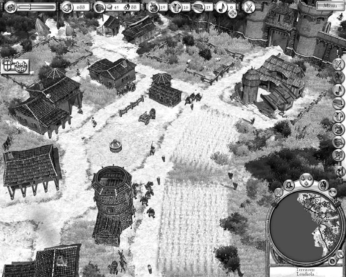
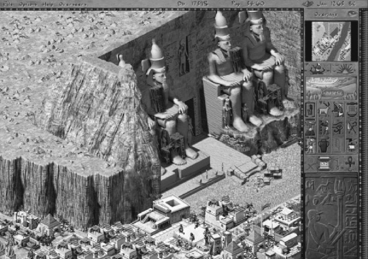
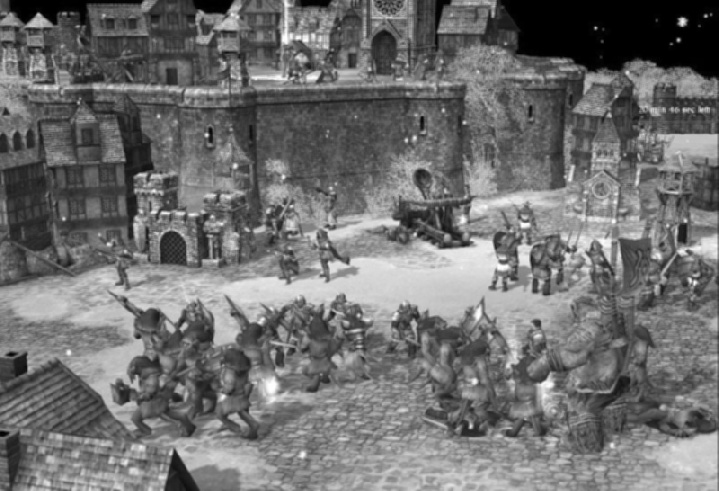
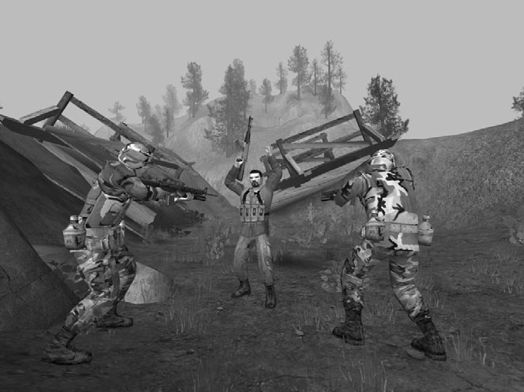
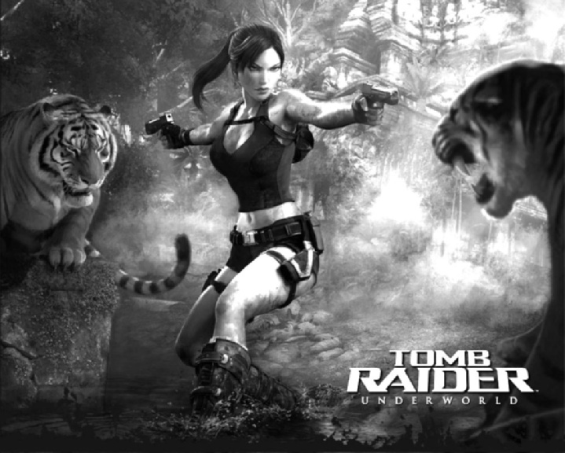
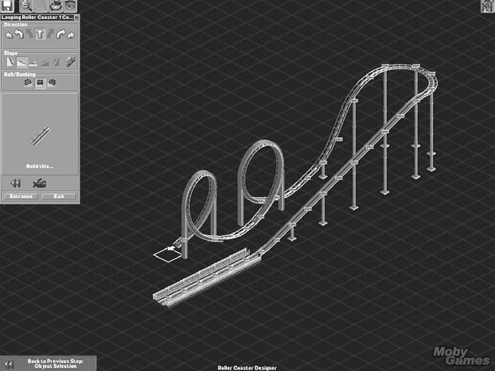
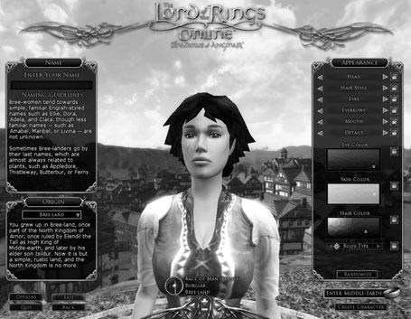

# 第4回：創造的プレイとキャラクター開発

> 対応章: Chapter 5 "Creative and Expressive Play" / Chapter 6 "Character Development"

---

## 第I部：創造的・表現的プレイ（Chapter 5）

ゲームをプレイすること自体が自己表現の一形態である。プレイヤーの判断にはプレイスタイル（慎重か大胆か、攻撃的か防御的か）が反映される。ビデオゲームでは、伝統的なゲーム以上に多彩な自己表現の手段を提供できる。本章では、ゲームに組み込める創造的プレイの類型を学ぶ。

---

### 1. 自己定義プレイ（Self-Defining Play）

プレイヤーがゲーム内で自分を表す **アバター** を選択・カスタマイズする行為を **自己定義プレイ** と呼ぶ。モノポリーでトークンを選ぶ行為もその一例である。プレイヤーは自分に似たアバターや、憧れのファンタジー像を選ぶことを楽しむ。特に女性プレイヤーはアバターの選択・デザインに強い関心を持ち、魅力を感じないアバターの使用を嫌う傾向がある。

#### 人格表現の形式

自己定義プレイには3つの段階がある。

| 形式 | 説明 | 例 |
|------|------|------|
| **アバター選択** | あらかじめ用意されたアバターから選ぶ | レースゲームでの車種選択 |
| **アバターカスタマイズ** | 外見や能力のパーツを差し替える | RPGでの装備変更、レースゲームの塗装やパーツ交換 |
| **アバター構築** | ゼロからアバターを組み立てる | 『The Elder Scrolls IV: Oblivion』の詳細なキャラクター作成 |

#### 属性（Attributes）の理解

アバターの特性を定義する値を **属性** と呼ぶ。属性は大きく2種類に分かれる。

- **機能的属性（Functional Attributes）**：ゲームプレイに影響する属性。『D&D』の筋力・知力・敏捷性など。さらに以下に細分される。
  - **キャラクタライゼーション属性**：キャラクターの根本を定義し、ほとんど変化しない（例：最大速度）
  - **ステータス属性**：現在の状態を示し、頻繁に変化する（例：現在のHP）
- **装飾的属性（Cosmetic Attributes）**：ゲームプレイに影響しないが、自己表現に寄与する属性。レースカーの塗装色など。

> **設計上の注意**: 機能的属性をプレイヤーに設定させる場合、その選択がゲームプレイにどう影響するかを明確に伝えなければならない。影響の分からない選択を強いることは、プレイヤーにとってストレスとなる。

#### 属性設定のベストプラクティス

- 『D&D』方式で一定のポイントを属性に配分させ、バランスを保つ
- デフォルト設定を用意し、すぐに遊び始めたいプレイヤーに配慮する
- 一度クリアした後に自由設定を解禁する方法もある

#### 性別は機能的属性か装飾的属性か

ゲームデザインにおいては、性別を装飾的属性として扱うのが望ましい。現実世界の平均的な性差をゲームの制約として持ち込むと、ファンタジー体験を損なう。筋力や敏捷性などの機能的属性は性別とは独立に設定可能にすべきである。

> **キーポイント**
> - 自己定義プレイはプレイヤーに個性の投影機会を与える
> - 属性は「機能的」と「装飾的」に大別される
> - 装飾的属性は低コストで楽しさを高める
> - 性別は装飾的属性として扱い、機能的ペナルティを付けない

---

### 2. クリエイティブプレイ（Creative Play）

多くのゲームはプレイヤーに何かを設計・構築する機会を提供する。『Caesar』シリーズではローマの都市、『Spore』では生物を作る。人は設計や構築を楽しむものであり、これが建設・経営シミュレーションの主要な魅力となっている。

クリエイティブプレイは保存・共有できるようにすべきである。スクリーンショットの撮影、他プレイヤーとの共有、Webへのアップロードなどの機能が創作の楽しさを増幅する。

#### 制約付きクリエイティブプレイ（Constrained Creative Play）

ルールが課す人為的制約の中で創造するプレイ形態。制約は創造の「構造」を提供する。

**経済による制限**: 『SimCity』では都市建設に資金が必要で、経済成長に伴い新施設が解禁される。経済管理が主な挑戦であり、創造力はその報酬として機能する。

**物理的基準への適合**: 『Spore』では生物を自由にデザインできるが、背骨を持つ陸上動物でなければならない。『RollerCoaster Tycoon』ではジェットコースターの設計が物理法則に準拠する必要がある。失敗時にはその理由をプレイヤーに伝えることが重要である。

**美的基準への適合**: 物理基準と異なり、美的基準には普遍法則がない。以下の実装方法がある。

1. **固定ルールによるテスト**: 色の組み合わせルールなど。ルールをプレイヤーが学べる仕組みが必須
2. **トレンドシステム**: 基準が時間とともに変動し、リサーチで部分的に把握可能
3. **オンライン投票**: コミュニティがプレイヤーの作品を評価する（『The Sims 2: H&M Fashion Runway』）

#### フリーフォームプレイとサンドボックスモード

制約なしに全機能を使える状態が **フリーフォームクリエイティブプレイ** である。通常は制約付きモードの特別版として **サンドボックスモード** が提供される。報酬は少ないかゼロだが、自由度が高く、プレイヤーに好評である。クリエイティブプレイを提供するゲームには、可能な限りサンドボックスモードを含めるべきである。

> **キーポイント**
> - 制約付きプレイは「経済」「物理」「美的基準」で構造化できる
> - 失敗時はその理由を伝えるフィードバックが不可欠
> - サンドボックスモードはコアメカニクスとの干渉が少なく、実装・調整が容易

---

### 3. ストーリーテリングプレイ（Storytelling Play）

ゲームの機能を使って自分自身の物語を創り、オンラインで配布するプレイ形態である。

- **高機能型**: 『The Movies』（Lionhead Software）ではカメラ配置、録画、編集が可能で、Adobe Premiere Pro等の外部ツールへ映像を書き出せる
- **簡易型**: 『The Sims』ではスクリーンショットにキャプションを付け、ストーリーボード形式でWebに公開できる
- **最小構成**: プレイヤーの行動ログをテキストで生成し、編集してナラティブ化する

複雑なビデオ編集ソフトを必要としないシンプルな方式でも、十分な成功を収められることを『The Sims』が証明した。

> **キーポイント**
> - ストーリーテリングプレイの複雑さは幅広いレンジで設計可能
> - シンプルなスクリーンショット+キャプション方式でも高い効果がある

---

### 4. ゲーム改変（MOD）

プレイヤーにゲーム自体の改変を許すことは、創造的自由の最高峰である。

- **MOD（Modifications）**: ハードコアゲーマーに極めて人気が高い。Unreal EnジンやHalf-Life 2エンジンのMODは、ゲーム本体の継続的な販売にも貢献する
- **レベルエディタ**: プレイヤーが独自のレベルを構築可能にするツール。公開する場合は、社内ツールと同等の堅牢性が求められる（例：StarCraft Campaign Editor、Half-Life 2のHammerエディタ）
- **Bot**: プレイヤー自身がプログラムするAI対戦相手。FPSで練習相手として利用されることが多い

> **キーポイント**
> - MODはゲームの寿命を大幅に延ばす商業的メリットがある
> - レベルエディタは製品品質の堅牢性が必要
> - MOD対応はプログラマ主導の課題だが、デザイナーも計画段階で関与すべき

---

## 第II部：キャラクター開発（Chapter 6）

> 「ハリー、私たちが何者であるかを示すのは、能力ではなく選択なのだ。」
> ―― J.K.ローリング『ハリー・ポッターと秘密の部屋』

キャラクターデザインは、物語を語り感情的な反応を喚起するうえで不可欠な要素である。英雄、悪役、苦境にある無辜の人々、傍観者――これらのキャラクターなしにはゲーム世界は空虚な殻にすぎない。

---

### 5. キャラクターデザインの目標

優れたキャラクターデザインには3つの目標がある。

1. **魅力（Appeal）**: 悪役であっても、人々を引きつける力を持つこと（例：ダース・ベイダー）
2. **信頼性（Credibility）**: 外見と行動に一貫性があり、プレイヤーが信じられること
3. **共感・同一化（Identification）**: 特にアバターの場合、プレイヤーがその靴に入りたいと思えること

キャラクターの各属性――身体、衣服、声、アニメーション、表情――は調和して役割を表現すべきである。ステレオタイプのキャラクターにも、他と区別する「何か」が必要である。

> **ビジネス上の意義**: 優れたキャラクターはゲームの知的財産として最も商業価値が高い。書籍、映画、玩具など多メディア展開の基盤となる。

> **キーポイント**
> - キャラクターは「魅力的」「信頼できる」「同一化可能」であるべき
> - 各属性の調和がキャラクターの明確さを生む
> - キャラクターIPは最大の商業資産となりうる

---

### 6. プレイヤーとアバターの関係

ゲーム業界で **アバター** とは、プレイヤーの操作下にある主人公キャラクターを指す。プレイヤーとアバターの関係は、アバターの設定度合いによって大きく異なる。

#### アバターの特定性スペクトラム

| 類型 | 特徴 | 例 |
|------|------|------|
| **非特定的アバター** | デザイナーが何も規定しない「空の器」 | ゴードン・フリーマン（Half-Life）、Myst |
| **半特定的アバター** | ある程度の外見・性格があるが詳細は不明 | マリオ、ララ・クロフト、リンク |
| **特定的アバター** | 独自の過去・性格・人間関係を持つ | マックス・ペイン、ナンシー・ドリュー、エイプリル・ライアン |

非特定的アバターはプレイヤー自身の投影先となる。特定的アバターとの関係は小説の主人公と読者の関係に近い。ただしゲームではプレイヤーが主人公を導ける点が異なる。特定的アバターはプレイヤーの指示を拒否することもある（例：『The Longest Journey』のエイプリル・ライアン）。

#### 操作方式の影響

- **間接操作**（ポイント&クリック）: プレイヤーは非物質的な案内人のように感じる
- **直接操作**（キャラクターを直接ステアリング）: プレイヤーはアバターそのものになる感覚を得るが、アバターは操り人形に近くなる

#### 男女プレイヤーとキャラクターの関係

- 男性プレイヤーはデフォルトアバターを比較的容易に受け入れる
- 女性プレイヤーはアバターを自己の延長と見なし、カスタマイズ機能を重視する
- ララ・クロフトが示したように、男性は女性アバターで「男性的活動」を行うことに抵抗がない
- 女性プレイヤーにとっては、過度に性的に描かれたキャラクターは同一化の障壁となる（例：Heather（Silent Hill 3）のようなリアルな女性像が好まれる）

> **キーポイント**
> - アバターの特定度合いがプレイヤーとの関係性を決定する
> - 直接操作は没入感を高めるが、アバターの独立性を弱める
> - 女性プレイヤー向けにはカスタマイズ機能が特に重要

---

### 7. ビジュアル外見（Visual Appearances）

キャラクターの外見はプレイヤーの感情に大きな影響を与える。外見から着手するデザイン手法を **アートドリブン・キャラクターデザイン** と呼ぶ。単純でカートゥン的なキャラクター、または多メディア展開を想定する場合に適する。

#### キャラクターの体型分類

- **ヒューマノイド**: 2本の腕・脚と1つの頭を持つ人間型。リアルまたはカートゥン比率
- **非ヒューマノイド**: 乗り物・機械型、動物型、モンスター型（R2-D2、ダーレクなど）
- **ハイブリッド**: 人間と機械の融合体（人魚、ボーグ、サイロンなど）

#### カートゥン的特性の4類型

| 類型 | 特徴 | 例 |
|------|------|------|
| **クール** | 超然・反権威的、サングラス、のんびりした体勢 | ラチェット（Ratchet & Clank） |
| **タフ** | 身体的攻撃性、大柄・大きな動作 | リュウ（Street Fighter） |
| **キュート** | 大きな目・頭、丸みのある体、明るい色 | マリオ |
| **グーフィー** | 奇妙なプロポーション、ぎこちない動き | クラッシュ・バンディクー |

> **文化的注意**: アートスタイルは文化によって大きく異なる。日本のアニメスタイル、ヨーロッパの漫画スタイルなど、販売対象国の文化的期待を十分に研究すべきである。

#### 過度な性的誇張の問題

キャラクターの性的特徴を極端に誇張する **ハイパーセクシュアライゼーション** は、若い男性には訴求力があるが、以下の問題を伴う。

- 類似キャラクターが飽和し、差別化が困難になる
- 年齢層の高いプレイヤーを遠ざける
- 女性プレイヤーに「歓迎されていない」というメッセージを送る
- ゲーム自体の技術的・デザイン的進歩を覆い隠す

ユーモアの文脈であれば許容される場合もあるが（『No One Lives Forever』のケイト・アーチャー）、外見だけでは質の低いゲームは売れない。

#### 衣装・武器・象徴的オブジェクト・名前

- 衣装と小道具はキャラクターを素早く識別させる重要な手段（インディ・ジョーンズの帽子とブルウィップ、ダース・ベイダーのマントとヘルメット）
- 武器の選択はキャラクター性を語る（肉切り包丁＝粗暴、レイピア＝優雅）
- ヘアスタイルや宝飾品は変化しにくく、視覚的識別子として有効
- **カラーパレット** を設定することで、キャラクターの態度・気質を色で表現する（スーパーマンの赤と青＝明朗、バットマンの暗色＝渋い）

> **デザインルール**: 視覚的特徴を盛り込みすぎない。2〜3の特徴で十分であり、それ以上は滑稽に見える。

#### コンセプトアートとモデルシート

- **コンセプトアート**: デザイン初期段階で「何を作るか」を伝える素描。短時間で描き、完成品ではなく説明と着想のためのもの
- **モデルシート**: 1キャラクターの複数ポーズを1枚にまとめ、感情・態度を表情と体勢で比較する伝統的アニメーション手法

> **キーポイント**
> - アートドリブンデザインはシンプルなキャラクターに適する
> - ハイパーセクシュアライゼーションは市場を狭める
> - カラーパレットと2〜3の視覚的特徴で明確な個性を構築する

---

### 8. キャラクターの深み（Character Depth）

外見だけでは伝えきれないキャラクターの内面を掘り下げる手法が **ストーリードリブン・キャラクターデザイン** である。キャラクターの役割・性格・行動を先に決め、それを基にアーティストが外見を開発する。

#### 役割・態度・価値観

主要キャラクターには **キャラクター背景資料（バックグラウンダー）** を作成する。出生地、家族、教育、趣味、恐怖症、政治信条、恋愛歴など、あらゆる側面を文書化する。

キャラクターの性格を伝える手段は3つ:
1. **外見**（前述のビジュアルデザイン）
2. **言語**（後述のオーディオデザイン）
3. **行動**（最も繊細な方法 ―― 見せるのであって、語るのではない）

#### キャラクターの次元性

キャラクターの感情的複雑さを4段階で分類する（『ロード・オブ・ザ・リング』の例で解説）。

| 次元 | 説明 | 例 |
|------|------|------|
| **0次元** | 離散的な感情状態のみ（憎悪/恐怖など）、混合感情なし | オーク |
| **1次元** | 1つの感情変数が時間とともに変化する | ギムリ（エルフへの敵意が徐々に友情に変わる） |
| **2次元** | 複数の感情変数があるが相互に矛盾しない | デネソール（誇り・軽蔑・絶望はあるが道徳的葛藤なし） |
| **3次元** | 複数の感情変数が矛盾を生じ、一貫性のない行動を引き起こす | フロド、ゴラム（指輪の誘惑による内的葛藤） |

3次元キャラクターの矛盾する感情をどう見せるか ―― 躊躇、途中での心変わり、無意識の自己妨害 ―― はプログラマとアーティスト双方との協議が必要な高度な設計課題である。

#### キャラクターの成長

ゲームが単なる冒険の連続以上のものを目指すなら、キャラクター成長が不可欠である。

- **アクションゲーム**: 新しい技・パワーアップ（物理的成長のみ）
- **アドベンチャーゲーム**: 個人的・感情的な文学的成長
- **RPG**: スキル、筋力・知力などの属性、および物語的な個人的成長

成長の表現方法は、画面上の数値表示（最も粗い方法）から、外見の変化、利用可能アクションの増加、言語・行動の変化（最も繊細な方法）まで幅広い。

#### キャラクター・アーキタイプ

ジョセフ・キャンベルの『千の顔を持つ英雄』が提唱した **英雄の旅** のパターンには、メンター、トリックスター、門番など、神話以来の普遍的なキャラクター類型が含まれる。クリストファー・ヴォグラーの『作家の旅』が脚本家向けに分かりやすく解説している。ただし、ゲームにアーキタイプを機械的に当てはめる必要はない。

> **キーポイント**
> - ストーリードリブンデザインは複雑なキャラクターに適する
> - キャラクターの次元性（0〜3次元）は感情的複雑さの設計指針となる
> - 「見せる、語らない」の原則がゲームでは特に重要
> - キャラクター成長はジャンルに応じて物理的/感情的/属性的に設計する

---

### 9. オーディオデザイン（Audio Design）

キャラクターデザインの重要な構成要素として、効果音・音楽・音声がある。

#### 効果音と音楽

- 音はキャラクターの性格を伝える（喋らなくても）。打撃音、掛け声はプレイヤーの操作に対する確認フィードバックとなる
- **深い音** は遅く強いキャラクター、**高い音** は軽く速いキャラクターを暗示する
- 音の質感は視覚的テクスチャと調和すべき（金属的な外見には金属的な音）
- 不調和はコメディ効果に利用できる

キャラクター固有の **音楽テーマ** は感情的インパクトを大きく高める。ジョン・ウィリアムズの『スター・ウォーズ』は好例：ダース・ベイダーの帝国マーチ（不協和なトランペット）、レイア姫の愛のテーマ、反乱同盟軍のメインテーマ。

- 悪や奇異なキャラクターには短調
- 善や英雄的キャラクターには長調
- ユニゾン演奏と単調なリズムは強制的画一性を暗示

> **実装上の注意**: 音楽・効果音・台詞/ナレーションは別々の音声ファイルとし、ゲーム内でミックスする。これによりローカライズ時の差し替えが容易になり、音楽と効果音を個別に音量調整できる（聴覚障害者への配慮として重要）。

#### 声と言語

キャラクターの話し方は膨大な情報を伝達する。

| 要素 | 伝達する情報 |
|------|-------------|
| **語彙** | 年齢、社会階層、教育レベル |
| **文法・構文** | 教育と階級（長く複雑な文は知性を連想させる） |
| **アクセント** | 出身地、社会階層 |
| **話速と声調** | 興奮、退屈、不安、敵意など感情状態 |
| **声の癖** | 吃音、舌足らず、決まり文句（「えー…どうしたんだい？」） |

『ザ・シンプソンズ』は言語によるキャラクター描写の優れた例である。ホーマーの限られた語彙は無教養を、リサの豊富な語彙と複雑な構文は学者肌を、バートの状況に応じた言語の切り替えは自覚的な享楽主義者を表現している。

> **キーポイント**
> - 効果音はプレイヤーへのフィードバックでありキャラクター表現でもある
> - 音楽テーマはキャラクターの感情的印象を強化する
> - 音声ファイルは音楽・効果音・台詞を分離して管理する
> - 語彙・文法・アクセント・声調・癖の5要素でキャラクターの社会的背景が伝わる

---

## まとめ：本講のポイント

1. **自己定義プレイ** はアバターの選択・カスタマイズ・構築を通じてプレイヤーの個性をゲーム世界に投影させる
2. **クリエイティブプレイ** は経済・物理・美的基準による制約で構造化でき、サンドボックスモードが自由な創作を可能にする
3. **ストーリーテリングプレイ** はシンプルな仕組みでも大きな成功を収めうる
4. **MOD・レベルエディタ** はゲームの寿命を延ばし、コミュニティを活性化する
5. **キャラクターデザイン** の目標は「魅力」「信頼性」「同一化」の3つ
6. **プレイヤーとアバターの関係** はアバターの特定度と操作方式に依存する
7. **ビジュアルデザイン** ではカラーパレットと少数の特徴で個性を構築し、過度な性的誇張を避ける
8. **キャラクターの深み** は0〜3次元の枠組みで設計し、「見せて語らない」原則を守る
9. **オーディオデザイン** は効果音・音楽テーマ・声と言語の3層でキャラクターを立体化する

---

## 考えてみよう（ディスカッション用）

1. あなたが最も感情移入したゲームキャラクターは誰か。そのキャラクターの「次元性」は何次元だと考えるか。
2. サンドボックスモードと制約付きモードでは、どちらがプレイヤーの創造性をより刺激するか。
3. キャラクターの性的誇張がゲーム市場に与える影響について、肯定的・否定的両面から議論せよ。
4. 自分がデザインするとしたら、アバターの特定度（非特定/半特定/特定）をどう設定するか、その理由は何か。
5. ゲームキャラクターのオーディオデザインにおいて、声優のキャスティングとキャラクターテーマ音楽のどちらがより重要か。

---

> **参考文献**
> Adams, E. (2014). *Fundamentals of Game Design* (3rd ed.). New Riders. Chapters 5-6.
