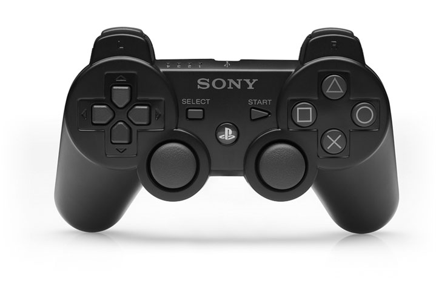

# 第7回：ゲームプレイ

---

## 1. はじめに

ゲームプレイとは、ゲームがプレイヤーに提示する**チャレンジ（課題）**と、それを克服するための**アクション（行動）**の関係で構成される。ゲームにはゲームプレイ以外のアクションも含まれるが、ゲームプレイの本質はチャレンジとアクションの相互関係にある。

本章では、ゲームを面白くする方法、チャレンジの階層構造、スキル・ストレス・難易度の概念、よく使われるチャレンジの種類、アクションの設計、そしてゲームの保存について学ぶ。

---

## 2. ゲームを面白くする方法

### 2.1 実行力はイノベーションに勝る

ゲームの面白さの大部分は、創造性やアイデアではなく**実行の質**によって決まる。退屈、フラストレーション、不快感の多くは、悪いアイデアではなく**悪い実行**から生まれる。以下に、面白さへの貢献度が高い順に要素を示す。

1. **基本的なミスの回避**（最重要）：バグのあるプログラム、低品質なUI、粗悪な音楽やアートはプレイヤーの楽しさを台無しにする
2. **チューニングとポリッシュ**：細部への配慮と完璧さの追求が、良いゲームと凡庸なゲームを分ける
3. **ゲーム前提の想像力豊かなバリエーション**：基本要素を活かした楽しい体験の構築（レベルデザイナーの仕事）
4. **真のデザインイノベーション**：面白さの源泉の約5%に過ぎない

### 2.2 ファンファクターを見つける原則

面白さを生む確実な公式は存在しないが、以下の原則を守ることでリスクを低減できる。

- **ゲームプレイ最優先**：グラフィックやストーリーよりも、プレイヤーが楽しめる行動を優先する
- **機能は完成させるか、省く**：壊れた機能を搭載するのは、機能を省くより遥かに悪い
- **プレイヤー中心の設計**：すべての決定をプレイヤーの視点から検証する
- **ターゲットを知る**：異なるプレイヤー層が求めるものは異なる
- **面白くない部分は抽象化・自動化する**：現実世界を模すゲームでも退屈な部分は省く
- **ビジョンに忠実であれ**：機能追加で市場を広げようとすると、本来の品質が損なわれる
- **調和・優雅さ・美しさを追求する**：美的完成度は楽しさを一段引き上げる

> **キーポイント**
> - ゲームの面白さの大部分はイノベーションではなく、バグの排除やチューニングなどの実行力から生まれる
> - 壊れた機能は省いた機能より有害。プレイヤー中心の設計を徹底すること

---

## 3. チャレンジの階層構造

### 3.1 階層の基本

ほとんどのゲームで、プレイヤーは複数のチャレンジに同時に直面する。これらは**階層構造（Hierarchy of Challenges）**として整理される。

| 階層レベル | 例 |
|---|---|
| 最上位 | ゲーム全体のクリア |
| ミッション | 現在のレベルのクリア |
| サブミッション | レベル内の個別目標 |
| アトミックチャレンジ | 目の前の敵を倒す、鍵を見つける等 |

**アトミックチャレンジ**とは、それ以上分割できない最小単位の課題である。アトミックチャレンジがサブミッションを構成し、サブミッションがミッションを、ミッションがゲーム全体のクリアを構成する。

*図：スキルとストレスの関係を示すグラフ。ゲームジャンルごとに要求されるスキルとストレスの度合いが異なる*

### 3.2 プレイヤーへのチャレンジの伝え方

チャレンジには、ゲームが直接伝える**明示的チャレンジ（Explicit）**と、プレイヤーが自ら発見する**暗黙的チャレンジ（Implicit）**がある。

- **最上位と最下位**は明示的に伝える（勝利条件とアトミックチャレンジの対処法）
- **中間レベル**は暗黙的に残す（プレイヤーが探索・観察・推理で発見する部分が面白さになる）

デザインルール：プレイヤーがどのような手段で勝利条件を達成しても、それを認めること。想定外の方法での勝利もズルではない。

### 3.3 複数のクリア方法を用意する

優れたゲームは勝利への道を複数用意する。一つの「正解」しかないゲームは、デザイナーの意図を読む作業になってしまう。例えば戦争ゲームで「旗を奪取する」という勝利条件に対して、ステルスアプローチ、攻撃的アプローチ、防御的アプローチなど異なる戦略を選べるようにする。

### 3.4 同時発生するアトミックチャレンジ

プレイヤーが複数のアトミックチャレンジに同時に直面する場合、注意力が分散する。時間制限下で同時に複数の課題に対処する必要があると、ゲームのストレスが増大する。SimCityのように、警察・電力・病院・水道など多数のサービスを同時にバランスさせるゲームでは、終わりのないジャグリング行為が求められる。

> **キーポイント**
> - チャレンジは階層構造で整理される。最上位の勝利条件から最下位のアトミックチャレンジまで
> - 勝利条件とアトミックチャレンジは明示的に、中間レベルは暗黙的に設計する
> - 同時に直面するアトミックチャレンジが多いほどストレスが増す

---

## 4. スキル・ストレス・難易度

### 4.1 固有スキル（Intrinsic Skill）

**固有スキル**とは、時間制限なしでチャレンジを克服するために必要なスキルレベルである。時間的プレッシャーを取り除いた状態で測定する。

- アーチェリー：的を遠くする・小さくすると要求スキルが上がる（時間は関係ない）
- 数独：難易度は手がかりの数で決まる（制限時間ではない）
- トリビア：知識の有無であり、時間を増やしても変わらない

### 4.2 ストレス

**ストレス**とは、時間的プレッシャーがプレイヤーの課題達成能力に与える影響の度合いである。制限時間が短いほどストレスが高まる。

- **テトリス**：固有スキルは低い（時間があれば簡単）が、時間的プレッシャーによりストレスが高い
- **ゴルフ**：高いスキルを要求するが、時間的プレッシャーは低い

ストレスは身体的にも影響し、心拍数やアドレナリンを上昇させる。ゲームのペーシングを調整してプレイヤーに休息を与えることが重要である。

### 4.3 絶対的難易度（Absolute Difficulty）

**絶対的難易度 = 固有スキル + ストレス** の組み合わせで決まる。

難易度レベルを設定する際には以下を考慮する：

- ターゲット層に応じて調整（若年層はストレス耐性が高い、高齢層はスキルは高いが反射神経は低下）
- スキルとストレスの逆相関を保つ：スキル要求が高いほど時間を与え、スキル要求が低いほど時間を短くする

> **キーポイント**
> - 固有スキル：時間制限がなくても必要な能力レベル
> - ストレス：時間的プレッシャーの影響
> - 絶対的難易度はこの2つの組み合わせ。難易度調整では両方を意識する

---

## 5. よく使われるチャレンジの種類

### 5.1 身体的協調チャレンジ

手と目の協調を中心とした身体能力のテスト。

| サブカテゴリ | 内容 | 代表例 |
|---|---|---|
| **速度・反応時間** | 素早い入力・即座の反応 | Track & Field, Quake |
| **正確性・精密さ** | ステアリング、射撃等 | レーシング、FPS、Fable |
| **物理の直感的理解** | 制動距離、加速率等の体得 | レーシング、ビリヤード、ダーツ |
| **タイミング・リズム** | 正しいタイミングでの入力 | Dance Dance Revolution, Guitar Hero |
| **コンビネーション技** | 複雑なボタン入力の連続 | 格闘ゲーム |

難易度調整のポイント：身体的協調チャレンジでは、主に**時間的プレッシャーの増減**で難易度を調整する。正確性については物理エンジンの許容誤差を調整する方法もある。

### 5.2 論理・数学チャレンジ

- **形式論理パズル**：パズルの定義内にすべての情報が含まれ、推論のみで解ける（例：ルービックキューブ）
- **数学的チャレンジ**：確率的推論が求められる（例：ポーカー、Microsoft Hearts）

*図：Microsoft Hearts。不完全情報下での確率的推論が求められるカードゲーム*

デザインルール：**試行錯誤でしか解けないパズルは避ける**。プレイヤーが実験から推論できるようにすること。

### 5.3 レースと時間プレッシャー

レースは「他者より先に何かを達成する」チャレンジ。時間プレッシャーは戦略的思考を阻み、直接的・力任せの解法を促す。時間プレッシャーを加える場合は、固有スキルの要求を下げてバランスを取ること。

### 5.4 事実知識チャレンジ

トリビア・クイズゲーム以外では、勝利に必要な知識はゲーム内で提供すべきである。外部知識を要求する場合は事前に明示すること。

### 5.5 記憶チャレンジ

ゲーム内で見聞きした情報の記憶を試す。アドベンチャーやRPGでよく使われる。難易度調整は、記憶時間と想起までの間隔で行う。

### 5.6 パターン認識チャレンジ

視覚的・聴覚的なパターンや行動パターンを見抜く能力を試す。典型例はアクションゲームの敵の行動パターン分析。パターンを短く・単純にすれば易しく、長く・複雑にすれば難しくなる。

### 5.7 探索チャレンジ

探索はそれ自体が報酬となるが、チャレンジなしの探索は単なる観光である。

| 種類 | 内容 |
|---|---|
| **空間認識** | 複雑な空間の把握。マップ提供で難易度を下げられる |
| **鍵付きドア** | 進行を阻む障害物。鍵探し・パズル解き・戦闘等で開く |
| **トラップ** | プレイヤーを害する装置。発見・回避・解除が楽しさ |
| **迷路・非論理空間** | 類似した部屋の構造を把握する。手がかりのない迷路は悪い設計 |
| **テレポーター** | 突然の場所移動。予測可能・可逆にすれば易しくなる |
| **隠しオブジェクト** | アイテムの捜索。イースターエッグは勝利に不要だが発見の喜びを与える |

### 5.8 コンフリクト（対立）

力の直接対決を伴うチャレンジ。戦闘だけでなく、チェッカーのような非暴力ゲームも含む。

- **戦略（Strategy）**：状況分析に基づく計画立案。完全情報ゲーム（チェス等）では純粋戦略、不完全情報下では応用戦略が必要
- **戦術（Tactics）**：計画の実行と予期せぬ事態への対応
- **兵站（Logistics）**：資源の生産・輸送・管理。RTS における武器生産、RPG における所持品管理
- **生存と敵の削減**：自軍の維持と敵の排除
- **脆弱なユニットの防衛**：チェスの王のような守るべき存在の保護
- **ステルス**：発見されずに行動する能力。Thief: The Dark Projectが代表例

### 5.9 経済チャレンジ

資源の生成・移動・保管・交換・消費のシステムが経済である。FPS の弾薬・体力管理のような単純なものから、SimCity のような全体が経済で構成されるゲームまで幅広い。

- **資源の蓄積**：富やポイントの獲得（Monopoly等）
- **バランスの達成**：複数資源の均衡維持（The Settlers等）
- **生き物の世話**：個体の欲求を限られた資源で満たす（The Sims, Spore等）

### 5.10 概念的推論とラテラルシンキング

- **概念的推論**：外部知識と推論力を組み合わせて解く（推理ゲーム等）
- **ラテラルシンキング**：明らかな解法が使えない状況で、物事の別の用途を発想する（アドベンチャーゲーム等）

ラテラルシンキングパズルでは、一般常識の範囲を超えない知識に留めること。ヒントや手がかりを用意することも重要。

> **キーポイント**
> - チャレンジの種類は多岐にわたる：身体的協調、論理、知識、記憶、パターン認識、探索、対立、経済、概念的推論
> - 各チャレンジの難易度は、固有スキルの要求と時間的プレッシャーの調整で制御する
> - 試行錯誤でしか解けないパズルは避け、プレイヤーが推論できる設計にする

---

## 6. アクション

### 6.1 アクションとは

アクションはゲームの「動詞」である。プレイヤーの入力がUIを通じてゲーム世界で引き起こす直接的なイベントを指す。「走る」「跳ぶ」「撃つ」「買う」「建てる」がアクションである。一方、プレイヤーの行動の結果として間接的に起きるイベントはアクションではない。

チャレンジには階層構造があるが、**アクションには階層構造がない**。アクションは入力デバイスに直接結びつく低レベルの操作として定義される。プレイヤーはこれらの基本アクションを組み合わせて、上位のチャレンジに対処する。

### 6.2 アクションの設計手順

1. **プレイヤーの役割から出発**：役割に関連する動詞をリストアップする
2. **アトミックチャレンジから逆算**：各チャレンジをどうやって克服するかを具体的に書き出す
3. **上位チャレンジの確認**：定義済みのアクションで上位チャレンジも達成できるか検証する
4. **ゲームプレイ以外のアクション**も検討する
5. 各ゲームプレイモードごとにこのプロセスを繰り返す

少数のアクションで多様なチャレンジに対応できるゲームが優れている（例：ルービックキューブは「面を90度回転」の1アクションのみ）。

### 6.3 ゲームプレイ以外のアクション

| 種類 | 内容 |
|---|---|
| 自由な遊び | 課題と無関係だが楽しい行動（観光、クラクションを鳴らす等） |
| 創造・自己表現 | アバターのカスタマイズ、建設等 |
| 社交 | マルチプレイヤーでの会話、グループ形成 |
| ストーリー参加 | NPC との対話、プロット選択 |
| ソフトウェア制御 | カメラ操作、一時停止、セーブ、音量調整等 |

> **キーポイント**
> - アクションはゲームの「動詞」で、入力デバイスに直結する低レベル操作
> - 少数のアクションで多様なチャレンジに対応する設計が理想的
> - ゲームプレイ以外のアクション（自由な遊び、創造、社交等）も重要

---

## 7. ゲームの保存

### 7.1 保存の意義

ゲームの保存は、ある時点のゲーム世界のスナップショットを記録し、後からその時点に戻ってプレイを再開する機能である。保存が必要な主な理由は以下の3つ。

1. **中断と再開**：40時間のゲームを一気にプレイすることは現実的でない
2. **致命的ミスからの回復**：アバターの死亡等からの復帰
3. **代替戦略の探索**：異なるアプローチを試す機会を提供

### 7.2 没入感とストーリーテリングへの影響

保存は没入感を損なう側面もある。ゲーム世界の外側で行われる行為であり、「過去に戻れないのが現実」という前提を破壊する。分岐ストーリーでは、やり直しによってドラマチックな緊張感が失われる。しかし、保存の利点はこれらの欠点を上回る。

### 7.3 保存方式の比較

| 方式 | 特徴 | 没入感への影響 |
|---|---|---|
| **パスワード** | レベルクリア時にパスワード付与。ストレージ不要の環境向け | 低い |
| **ファイル/スロット保存** | 任意時点で名前付きスロットに保存。最も一般的 | 高い（ファイル管理画面が世界観を壊す） |
| **クイックセーブ** | ボタン一つで即時保存。FPS等で多用 | 低い（ゲーム世界を離れない） |
| **自動保存/チェックポイント** | 通過時に自動保存。プレイヤーの操作不要 | 最小（ただしプレイヤーの制御が限定的） |

### 7.4 保存を制限すべきか

一部のデザイナーは「保存がゲームを簡単にしすぎる」として保存を制限するが、これは**怠惰な設計**である。保存を禁止するのではなく、より良いチャレンジを設計すべきである。レベル終盤のミスで最初からやり直しを強いることは、プレイヤーの時間を浪費しフラストレーションを生む。

> **キーポイント**
> - 保存は中断・再開、ミスからの回復、戦略探索のために不可欠
> - 保存方式ごとに没入感への影響が異なる。クイックセーブは没入感を保ちやすい
> - 保存の制限は楽しさを加えず難しさだけを加える。怠惰な設計の典型

---

## 8. 本章のまとめ

本章では、ゲームプレイを構成する中核概念を体系的に学んだ。

1. **面白さの源泉**：イノベーションよりも実行の質。バグの排除、チューニング、プレイヤー中心の設計が重要
2. **チャレンジの階層構造**：ゲーム全体の勝利条件からアトミックチャレンジまでの階層。明示的/暗黙的チャレンジのバランスが鍵
3. **スキル・ストレス・難易度**：固有スキルと時間的プレッシャー（ストレス）の組み合わせが絶対的難易度を決定する
4. **チャレンジの種類**：身体的協調、論理、知識、記憶、パターン認識、探索、対立、経済、概念的推論など多様な種類がある
5. **アクション**：ゲームの「動詞」。少数の基本アクションで多様なチャレンジに対応する設計が理想
6. **ゲームの保存**：プレイヤーの利便性を最優先し、保存方式は没入感とのバランスで選択する

ゲームデザイナーの仕事は、これらの要素を組み合わせ、ターゲットプレイヤーにとって最も楽しい体験を構築することである。
