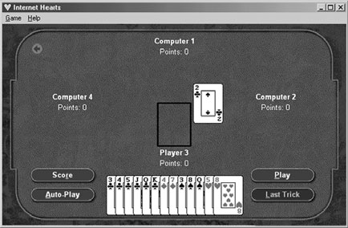

# 第8回：コアメカニクス

---

> *"すべてのルールの中で最も偉大なルールとは、ただ人を楽しませることではないか？"*
> ―― モリエール

---

## 1. コアメカニクスとは何か

### 1.1 定義

**コアメカニクス**とは、ゲームのルールと内部動作を正確に定義するデータとアルゴリズムの総体である。

デザインの初期段階では「沼を通り抜けるのに時間がかかりすぎるとペナルティがある」といった曖昧な記述で十分だが、コアメカニクスの段階では「アバターが沼に入ると黒いキノコが毒ガスを放出し、3秒ごとに1ゲームワールドインチの速度で画面下部から上昇、3分後にアバターの顔の高さに達したら死亡する」というレベルまで具体化する必要がある。

### 1.2 ルールからコアメカニクスへ

モノポリーの印刷ルールは3ページに満たないが、コンピュータゲームとして実装するには、各物件の価格、家賃テーブル、ボードのレイアウト、チャンスカードの全効果など、はるかに詳細な仕様が必要となる。これがルール（概要）とコアメカニクス（完全な仕様）の違いである。

### 1.3 コアメカニクスの所在

コアメカニクスの実装は開発フェーズによって変化する。

| 段階 | 実装形態 | 変更方法 |
|------|----------|----------|
| 初期設計 | デザインドキュメント（自然言語） | ドキュメント編集 |
| プロトタイプ | スプレッドシート／紙プロトタイプ | 値の調整 |
| 開発段階 | プログラムコード＋データファイル | コード変更 |

プレイヤーはコアメカニクスを直接目にすることはない。画面上の何かを指して「これがコアメカニクスだ」とは言えない。プレイヤーはゲームの振る舞いからメカニクスの機能を推測するのみである。

> **設計原則：ゲームを設計せよ、ソフトウェアを設計するな**
> コアメカニクスはゲームエンジンが「何をするか」を定めるが、「どのようにするか」はプログラマに委ねる。

### 1.4 コアメカニクスの機能

プレイ中、コアメカニクス（ゲームエンジンとして実装されたもの）は以下を担う。

- **内部経済の運用**：ゲーム経済の基盤となるリソースの生産・分配・消費を管理する
- **能動的チャレンジの提示**：レベルデザインの指定に従い、UIを通じてプレイヤーにチャレンジを出す
- **プレイヤーアクションの受理と処理**：入力を受け、ゲーム世界への影響を計算する
- **勝利・敗北の検出**：終了条件の判定と結果の適用
- **NPCのAI制御**：ノンプレイヤーキャラクターや人工的な対戦相手の行動制御
- **ゲームモードの切り替え**：現在のモードを管理し、UIに更新を通知する
- **ストーリーテリングエンジンへのトリガー送信**：プロットに影響するイベント発生時の通知

### 1.5 リアルタイムとターン制の違い

**リアルタイムゲーム**では、メカニクスはプレイヤーの行動有無にかかわらず動き続ける「生きた世界」を定義する。AI駆動のキャラクターは自律行動し、罠は発動条件をチェックし続ける。

**ターン制ゲーム**では、プレイヤーがターンを終えるまでメカニクスは待機し、行動後にその効果を計算する。プロセスを設計する場合でも、次のプレイヤーのターンのために安全に中断できるポイントを含める必要がある。

> **キーポイント**
> - コアメカニクスはゲームのルールと内部動作をデータ＋アルゴリズムで正確に定義したもの
> - プレイヤーはメカニクスを直接見ないが、ゲーム体験のすべてがメカニクスから生まれる
> - リアルタイムでは連続プロセス、ターン制ではイベントの連鎖として設計する

---

## 2. キーコンセプト：リソース・エンティティ・属性

### 2.1 リソース（Resources）

**リソース**とは、ゲームが移動・交換でき、数値として扱える物体や素材の「型（タイプ）」を指す。特定のビー玉ではなく「ビー玉という概念」がリソースであり、プレイヤーのポケットの中の15個のビー玉は「リソースのインスタンス」である。

リソースは物理的なもの（弾薬、金貨）に限らず、人気度・毒への耐性など抽象概念も数値化してリソースとして扱える。ゲームデザイナーの仕事の一部は、カリスマや好戦性といった「測定不能なもの」をプログラムが操作できる数値に変換することである。

> 純粋に装飾的なアイテム（プレイヤーが何もできず、何も起こらない花など）はリソースではない。

### 2.2 エンティティ（Entities）

**エンティティ**とは、リソースの特定のインスタンス、またはゲーム世界の要素の状態を指す。

| 種類 | 説明 | 例 |
|------|------|------|
| **単純エンティティ** | 単一の値で完全に記述できる | スコア（数値型）、信号機の状態（記号型：赤/黄/緑） |
| **複合エンティティ** | 複数の属性で構成される | 風（速度＋方向）、アバター（名前・HP・種族・所持品等） |
| **ユニークエンティティ** | ゲーム内に1つしか存在しない | アバター本体、フットボールのボール |

### 2.3 属性（Attributes）

**属性**とは、あるエンティティに属し、それを記述するエンティティである。アバターの「HP」「種族」「所持品」はすべてアバターの属性であり、各属性自体が単純エンティティまたは複合エンティティとなりうる。

エンティティを設計する際は、初期値（数値型なら範囲と初期量、記号型なら取りうる状態一覧と初期状態）を定め、チューニング段階で調整する。

### 2.4 メカニクス（Mechanics）

**メカニクス**は、ゲーム世界とその中のすべての振る舞いを文書化したものであり、以下の4要素で構成される。

1. **関係（Relationships）**：エンティティ間の依存関係。数式で表す場合もある（例：キャラクターレベル = 経験値 / 1000）
2. **イベント（Events）**：条件に発動され、1回実行される変化（「金の卵を拾うと2点獲得」）
3. **プロセス（Processes）**：開始後、停止されるまで継続する一連の活動
4. **条件（Conditions）**：イベントの発生やプロセスの開始・停止を定義する（if〜then、whenever〜、until〜）

ゲーム全体を通じて動作するメカニクスを**グローバルメカニクス**と呼ぶ。複数のゲームプレイモードを持つゲームでは、モード切替を管理するグローバルメカニクスが必須となる。

### 2.5 数値的関係と記号的関係

**数値的関係**は算術演算で定義される（例：小麦粉1袋＋水4バケツ → パン50斤）。数式の設計では、ゼロ除算の回避やドミノ効果の予測が重要である。

**記号的関係**は数学的操作ができない状態値（赤/黄/緑など）間の関係を定義する。各状態について、他のエンティティとの相互作用を個別に記述する必要がある。二値エンティティは**フラグ**と呼ばれる。

**統合**：記号エンティティの状態変化を数値条件で定義できる（例：「燃料が2ガロン未満になったら警告灯をON」）。逆に、記号を数値に変換するテーブル（ギア比テーブルなど）を作成し、計算に組み込むこともできる。

> **キーポイント**
> - リソースは「型」、エンティティは「インスタンス」。この区別が設計の基盤
> - エンティティは単純・複合・ユニークに分類される
> - メカニクスは関係・イベント・プロセス・条件の4要素で構成される
> - 数値的関係と記号的関係を適切に組み合わせることで多様なゲーム動作を実現する

---

## 3. 内部経済（Internal Economy）

**内部経済**とは、リソースとエンティティが数量的に生産・消費・交換されるシステムである。内部経済の複雑さはジャンルによって大きく異なる。

### 3.1 ソース（Source）

リソースがゲーム世界に新たに出現する仕組みを**ソース**と呼ぶ。

- シューティングゲームの**スポーンポイント**：敵・武器・弾薬・回復アイテムを生成する場所。位置、生成するリソースの種類、頻度を定義する
- 自動生産：工場を建設するとリソースが自動的に生成される。生産レートの定義が必要
- **限定ソース**と**無限ソース**：モノポリーの「Go」マスは無限の資金源。家・ホテルの在庫は限定ソース

### 3.2 ドレイン（Drain）

リソースがゲーム世界から永久に消滅する仕組みを**ドレイン**と呼ぶ。

- 発砲による弾薬の消費、敵の死亡によるHP消滅
- 建設管理シミュレーションの**劣化（Decay）**：建造物が時間経過で損傷し、修理にリソースを要する

> **設計上の注意**：リソースが消えるときには必ず理由をプレイヤーに説明すること。プレイヤーは無料で得ることは気にしないが、失うときには理由を求める。

### 3.3 コンバーター（Converter）

1つ以上のリソースを別の種類のリソースに変換する仕組みを**コンバーター**と呼ぶ。生産レートと入出力比率の定義が必要。

- 『The Settlers』の風車：穀物1袋 → 小麦粉1袋（20秒、毎分3袋）
- 製鉄所：鉱石1＋石炭1 → 鉄棒1、ただし木炭使用時は木炭3必要

### 3.4 トレーダー（Trader）

リソースの所有権を移転させる仕組みを**トレーダー**と呼ぶ。コンバーターと異なり、アイテム自体は変化しない。

> **暴利問題への対策**：プレイヤーが安く買って高く売る行為を無制限に繰り返せると、ゲームが破綻する。対策として、再販価格を購入価格以下に制限する、売買間にクールダウンを設ける、トレーダーの資金を有限にする、などがある。

### 3.5 有形リソースと無形リソース

- **有形（Tangible）**：物理的に存在し、保管・輸送が必要（シューターの弾薬など）
- **無形（Intangible）**：空間を占めず、輸送不要（多くのゲームにおける金銭）
- **混合型**：『Age of Empires』では輸送中は有形（敵に奪われる）、貯蔵後は無形（破壊されない）

### 3.6 フィードバックループとデッドロック

**フィードバックループ**：生産メカニズムが自身の生産物を入力として必要とする構造。例：『The Settlers III』では石が石切り小屋の建設に必要で、石切り小屋が石を生産する。

**デッドロック**：フィードバックループの中でリソースが枯渇し、生産が完全停止する状態。モノポリーの「Go」で毎周200ドルもらえるのは、物件を買えない→家賃収入がない→物件が買えない、というデッドロックを防ぐためである。

> **設計原則：デッドロックを打破する手段を必ず提供せよ**

### 3.7 静的均衡と動的均衡

- **静的均衡**：生産量と消費量が常に一定で、リソースの量が変化しない状態
- **動的均衡**：生産と消費がサイクルで変動するが、一巡すると同じ状態に戻る

均衡状態ではプレイヤーへの圧力が減るため、多くのゲームでは意図的に均衡を崩す要素を導入する（農場の老朽化、道路の劣化など）。成長を達成するにはプレイヤーの能動的な介入が必要となるよう設計することが重要である。

> **キーポイント**
> - 内部経済はソース→コンバーター→トレーダー→ドレインのリソースフローで構成される
> - フィードバックループはデッドロックのリスクを伴う。必ず脱出手段を用意する
> - 均衡と不均衡のバランスがゲームプレイの緊張感を生む

---

## 4. コアメカニクスとゲームプレイの関係

### 4.1 受動的チャレンジと能動的チャレンジ

| 種類 | 定義 | メカニクスの役割 | 例 |
|------|------|------------------|------|
| **受動的（Passive）** | 静的な障害物 | チャレンジ自体にメカニクス不要 | 壁を乗り越える |
| **能動的（Active）** | 動的な仕組みを持つ | エンティティとメカニクスの定義が必要 | パズルを解いてドアを開ける、敵と戦闘 |

コアメカニクスは能動的チャレンジに必要なエンティティとメカニクスをレベルデザイナーに提供する「LEGOブロック」の役割を果たす。

### 4.2 アクションとコアメカニクス

プレイヤーのアクションはメカニクスをトリガーする。

**例：しゃがみアクション**
1. プレイヤーがしゃがみボタンを押す
2. UIがしゃがみメカニクスをトリガー
3. アバターの「姿勢」属性（記号型）が「直立」から「しゃがみ」に変化
4. アバターの「頭部の高さ」属性（数値型）が低下
5. グラフィックエンジンが視点を更新

アナログ入力（マウス移動量など）を伴うアクションでは、UIからデータを受け取り、属性値を適切に変更するメカニクスが必要となる。

> **キーポイント**
> - 受動的チャレンジはメカニクス不要、能動的チャレンジはメカニクス必須
> - プレイヤーアクションはUIを通じてメカニクスをトリガーし、エンティティの状態を変更する

---

## 5. コアメカニクスのデザイン手法

### 5.1 デザインの目標

#### シンプルさとエレガンス
最も優れたゲームは最小限のルールで興味深い多様性を生み出す。モノポリーのルール自体はシンプルだが、チャンスカードが「所得税還付：20ドル受け取る」などバリエーション豊かな文脈を添えることで面白さを増している。

#### パターンの発見と一般化
個別ケースを列挙するのではなく、共通パターンを見つけて一般化する。例えば「沼ヒルは水から出ると毎分10HP減少」「サラマンダーは火から出ると毎分5HP減少」という個別ルールは、「環境依存クリーチャーは固有環境から離れると一定レートでHP減少」という一般ルールに統合できる。

#### 紙上での完璧を求めない
すべてを頭の中で計算するのは不可能。まずドラフトを書き、プロトタイプで検証し、反復的に改善する。明確で正確な記述の方が、正確だが曖昧な記述よりも重要である。

#### 適切な詳細度
- 詳細すぎる：デザイナーが作業量で潰れる
- 不足しすぎる：プログラマが推測で実装し、バグの原因になる
- **適切な水準**：慣習的なシナリオは一般的な言語で記述し、独自のメカニクスほど詳細に記述する

### 5.2 デザインのステップ

**ステップ1：既存の設計成果を見直す**

以前のデザインドキュメントを読み返し、名詞と動詞を抽出する。
- 名詞 → エンティティまたはリソースの候補
- 動詞 → メカニクスの候補
- if / when / whenever → 条件の候補

特に以下を精査する：
- 「プレイヤーは何をするのか？」への回答
- ゲーム構造のフローボード
- 各ゲームプレイモードの計画
- ストーリーの概要と分岐条件
- レベルの進行計画と勝利・敗北条件

**ステップ2：エンティティとリソースのリスト化**

抽出した名詞を分類し、以下を決定する：
- リソースか、独立エンティティか、他エンティティの属性か
- 単純か複合か。数値型か記号型か
- 初期値と取りうる範囲

**ステップ3：メカニクスの追加**

動詞のリストとエンティティの一覧を手に、「somehow（何らかの方法で）」と書かれた部分を正確な仕様に置き換える。

- リソースのフローを考える（ソース、ドレイン、コンバーター、トレーダー）
- 各エンティティについて「何が影響するか」「何に影響するか」「自律行動はあるか」「プレイヤーは操作できるか」を問う
- チャレンジとアクションの対応関係を定義する
- グローバルメカニクスを特定する

> **キーポイント**
> - パターンを見つけて一般化し、少ないルールで多くの状況をカバーする
> - 反復的改善を前提とし、プロトタイプで検証する
> - 名詞→エンティティ、動詞→メカニクス、条件語→条件として設計を進める

---

## 6. 乱数とガウス曲線

### 6.1 乱数の基本

コンピュータが生成する乱数は通常0以上1未満の実数値である。確率0.1のイベントは、生成した乱数が0.1未満のときに発生する（10%の確率）。命中精度0.8の武器は、乱数 < 0.8 なら命中する。

### 6.2 疑似乱数（Pseudo-Random Numbers）

乱数生成アルゴリズムは**シード値**によって数列が決まる。同じシードなら毎回同じ乱数列が得られるため、チューニングやバグ修正に極めて有用。製品版出荷時にはシステムクロックなどからシードを取得し、毎回異なる体験を提供する。

### 6.3 モンテカルロ・シミュレーション

複雑なメカニクスの挙動を検証するために、ランダムな入力で大量の試行（例：1000回）を行い、結果を分析する手法。弱いチームが強いチームに勝つ頻度が妥当かどうか、入力と結果の相関が正しいかどうかを確認できる。Excelなどのスプレッドシートに組み込みツールが用意されている。

### 6.4 一様分布と非一様分布

**一様分布（Uniform Distribution）**：すべての値が等確率で出現する。1個のサイコロを振る場合と同じ。選択肢のランダムな並べ替えなどに使う。

**非一様分布**：複数のサイコロの合計値のように、中央値付近が出やすく極端な値が出にくい分布。オリンピックの弓射手のように「的の中心に当たりやすい」シミュレーションに向く。

### 6.5 ガウス曲線（正規分布）

複数のサイコロの合計値は**ベル型（ガウス）曲線**を描く。

- 6面サイコロ2個：7が出る確率（6/36 = 16.7%）は2が出る確率（1/36 = 2.8%）の6倍
- 6面サイコロ3個：10や11が出る確率（27/216）は3や18が出る確率（1/216）の27倍

これは「3面から18面の16面サイコロを1個振る」のとは全く異なる。16面サイコロでは18が出る確率は6.25%だが、3個の6面サイコロの合計で18が出る確率は0.46%に過ぎない。

ガウス分布は水滴の落下パターンや知能の分布など自然界の多くの現象を記述する。「大多数は中央に集まり、極端な値はまれ」という効果が必要なときに使う。

> **キーポイント**
> - 疑似乱数は同じシードで再現可能。チューニングとデバッグに不可欠
> - 一様分布は等確率の選択に、ガウス分布は「中央に集まる」効果に使う
> - モンテカルロ・シミュレーションで複雑なメカニクスの妥当性を統計的に検証できる

---

## 授業のまとめ

| 概念 | 要点 |
|------|------|
| **コアメカニクス** | ゲームのルールと内部動作をデータ＋アルゴリズムで正確に定義したもの |
| **リソース** | 数量として扱える物体・素材の「型」 |
| **エンティティ** | リソースのインスタンスまたはゲーム世界の状態。単純/複合/ユニークに分類 |
| **属性** | エンティティに属し、それを記述するエンティティ |
| **メカニクス** | 関係・イベント・プロセス・条件の4要素で構成 |
| **内部経済** | ソース・ドレイン・コンバーター・トレーダーによるリソースフロー |
| **デザイン手法** | 名詞→エンティティ、動詞→メカニクスの抽出。パターンの一般化と反復的改善 |
| **乱数** | 一様分布とガウス分布を目的に応じて使い分ける |

---

*本資料は Ernest Adams 著『Fundamentals of Game Design』Chapter 10 に基づく講義用テキストです。*
