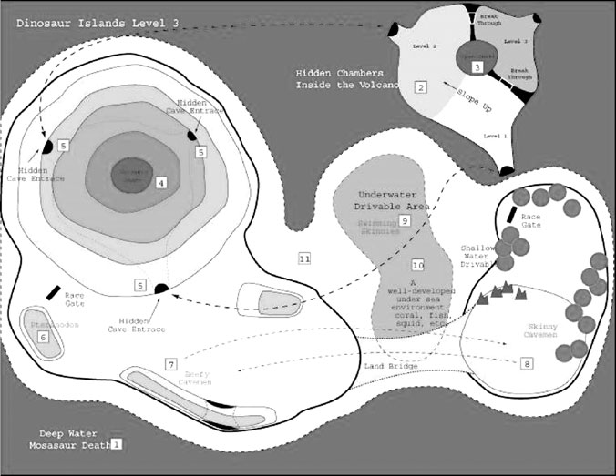

# 第10回：レベルデザインの原則

---

## はじめに

レベルデザイナーは、ゲームが展開する空間だけでなく、プレイヤーの瞬間ごとの体験や感情的な文脈の多くを創り出す。本章では、レベルデザインの一般原則、空間レイアウトの類型、設計プロセス、そして陥りやすい落とし穴について学ぶ。

---

## 1. レベルデザインとは何か

レベルデザインとは、ゲームデザイナーが用意したコンポーネントを使い、プレイヤーに直接提供される体験を構築するプロセスである。ゲームデザイナーとレベルデザイナーは別の役割であり、大規模な開発チームでは通常、異なる人物が担当する。

レベルデザイナーが作り出す要素は、**ゲーム空間**（何がどこにあるかの具体化）、**初期条件**（敵の数やリソース配置）、**チャレンジ群**（挑戦の内容と順序）、**終了条件**（勝敗の基準）、**ストーリーとの連携**、**美的演出・雰囲気**の6つに大別される。

> **キーポイント**
> - レベルデザインは「体験の構築」であり、空間設計だけでなくチャレンジ配置・物語展開・雰囲気づくりを含む
> - ゲームデザイナーが「何を」決め、レベルデザイナーが「どこに・どのように」を決める

---

## 2. 主要デザイン原則

### 2.1 普遍的なレベルデザイン原則

以下の原則はジャンルを問わず、あらゆるゲームのレベルデザインに適用される。

1. **序盤をチュートリアルにする** --- 操作や仕組みを実践で学ばせる
2. **ペーシングを変化させる** --- 緊張と緩和を交互に配置する
3. **リソース消費後に補充を用意する** --- 困難なチャレンジの直後に回復手段を置く
4. **概念的な矛盾を避ける** --- 世界観に合わない不合理な配置をしない
5. **短期目標を常に明確にする** --- 「次に何をすべきか」を常にわかるようにする
6. **リスク・報酬・結果を明示する** --- 「死んで覚える」設計は悪い慣行である
7. **技術・知性・献身を報酬で称える** --- 多様な形で良いプレイに報いる
8. **報酬は大きく、罰は小さく** --- 過度な罰はゲーム離脱を招く
9. **前景を背景より優先する** --- 背景を複雑にしすぎない
10. **AI敵は善戦して負けるために存在する** --- クリア不能なレベルは悪い設計
11. **複数の難易度設定を用意する** --- 幅広いプレイヤー層に対応する

### 2.2 ジャンル固有の原則

各ジャンルには特に重視すべき原則がある。アクションゲームでは**ペースの緩急**、ストラテジーでは**計画への報酬**、RPGでは**キャラクター成長と自己表現**、スポーツでは**現実らしさの徹底**、アドベンチャーでは**チャレンジとストーリーの調和**、パズルでは**考える時間の確保**が、それぞれ最重要原則となる。

> **キーポイント**
> - 普遍的原則の核心は「明確な目標」「適切なペーシング」「報酬と罰のバランス」「リソース補充」
> - ジャンルごとに重点は異なるが、「プレイヤー中心設計」は共通

---

## 3. レイアウトの種類

移動を伴うゲームでは、空間のレイアウトがプレイ体験に大きな影響を与える。代表的なレイアウトパターンは以下の通りである。

### 3.1 オープンレイアウト

プレイヤーの移動がほぼ制約されない、屋外のような自由空間。『Battlefield 1942』のような戦争ゲームで多用される。RPGでもフィールド探索時に使われるが、屋内やダンジョンではネットワーク型に切り替わることが多い。

### 3.2 リニア（線形）レイアウト

プレイヤーが決められた順序で空間を体験する構造。分岐がなく、次のエリアか前のエリアにしか移動できない。「レール上」とも呼ばれ、横スクロールアクションやレールシューターに伝統的。線形ストーリーとの相性がよい。ただし一方通行のドアを設置する場合、後戻りできないエリアに必須アイテムを置かないよう注意が必要である。

### 3.3 パラレル（並列）レイアウト

線形レイアウトの発展形。プレイヤーはレベルの始点から終点へ進むが、途中で複数の並行経路を選択できる。ある経路はリスクが高い代わりに報酬も大きく、別の経路はストーリー情報が豊富、といった差別化が可能。隠しショートカットを用意する場合は、必ず何らかの手がかりを設けること（手がかりなしの隠し通路は試行錯誤を強いる悪い設計）。

### 3.4 リング（環状）レイアウト

経路が出発点に戻る構造。レースゲームで主に使われ、プレイヤーは同じ空間を周回する。ショートカットは通常ルートより短いが比例して難しくする必要があり、このバランス調整がレベルデザイナーの重要な仕事となる。

### 3.5 ネットワークレイアウト

空間同士が多様な方法で接続される構造。探索自体が大きなゲームプレイとなる。全空間が相互接続されていればデスマッチに適するが、順序立てたストーリーテリングには不向き。

### 3.6 ハブ＆スポークレイアウト

中央のハブ（安全な拠点）から複数のスポーク（線形経路）が伸びる構造。プレイヤーはスポークの先端でチャレンジと報酬を得て、ハブに帰還する。スポークの開放を段階的にすれば難易度を制御できる。『Spyro the Dragon』シリーズが代表例。

### 3.7 レイアウトの組み合わせ

多くのゲームでは複数のレイアウトを組み合わせる。典型的なのは、大きな線形フレームワークの中にネットワーク型の探索空間を配置する構造であり、大型RPGやアドベンチャーゲームに多い。

> **キーポイント**
> - 6つの基本レイアウト（オープン・リニア・パラレル・リング・ネットワーク・ハブ＆スポーク）を目的に応じて選択・組み合わせる
> - レイアウト選択はストーリー構造、チャレンジの提示方法、プレイヤーの自由度に直結する

---

## 4. 雰囲気・進行・ペーシング

### 4.1 雰囲気（アトモスフィア）の構築

レベルデザイナーは以下の要素を組み合わせて、レベルの美的一貫性とムードを作り出す。

- **ライティング・カラーパレット** --- 光の配置・色彩で安全感や危険感を演出する
- **天候・大気効果** --- 霧、雨、雪、風が心理的印象を生む
- **視覚・音響エフェクト** --- 武器の反動、魔法の火花、タイヤのスキール音などで感情を喚起する
- **音楽・環境音** --- リズムがペースを、環境音が場所と時間の感覚を支える

### 4.2 進行（プログレッション）の設計

ゲーム全体を通してレベル間で以下の要素が段階的に変化すべきである。

1. **メカニクスの豊富さ** --- 序盤は単純に、後半は複雑に
2. **プレイ時間** --- 後半のレベルほど長くなる傾向
3. **付随的報酬と環境変化** --- カットシーン、トロフィー、アンロックコンテンツ、風景の変化
4. **実用的報酬** --- 新しい乗り物、装備、スキル、技術
5. **難易度** --- 原則として徐々に上昇する
6. **プレイヤーアクション** --- 新しいアクションを段階的に追加する
7. **ストーリー展開** --- プレイの進行とともに物語も前進する
8. **キャラクター成長** --- 能力面だけでなく、文学的な意味での人間的成熟も含む

### 4.3 ペーシングの設計

ペーシングとは、プレイヤーがチャレンジに遭遇する頻度のことである。

**緩急の交替が基本原則** --- ゲームのペースも交響曲やアクション映画と同様、速い区間と遅い区間を交互に配置する。ストレスの高いチャレンジの後にはリソース補充や探索の時間を挟む。『指輪物語』では冒険団が危機を乗り越えるたびに休息地を見つけるが、これはゲームのペーシング設計と同じ構造である。

**全体のペース** --- レベル全体としてはペースが一定か、終盤に向けて加速すべきである。レベル末のボス戦は伝統的な手法であり、勝利と報酬をもたらす。線形レイアウトほどペーシング制御がしやすく、自由度の高いジャンルでは制御が難しくなる。

### 4.4 チュートリアルレベル

現代のゲームでは、チュートリアルレベルで操作方法を実践的に教える。設計の要点は、機能を順序立てて導入すること、未紹介機能は無効化しておくこと、UI要素を視覚的にハイライトすること、失敗ペナルティをなくすこと、そして**チュートリアルを任意参加にする**ことである。

> **キーポイント**
> - 雰囲気づくりではライティング・色彩・音響・天候を総合的に設計する
> - 進行は8つの要素（メカニクス、時間、報酬、難易度、アクション、ストーリー、キャラクター成長等）で段階的変化を設計する
> - ペーシングの核心は「緊張と緩和の交替」であり、リソース補充のタイミングと密接に関連する

---

## 5. レベルデザインプロセス

レベルデザインは反復的なプロセスであり、以下の11段階で進行する（Knowles & Ganetakos, 2004に基づく）。

### ステップ1：ゲームデザインからの引き継ぎ

ゲームデザイナーからレベルの設定・雰囲気・主要ゲームプレイ・イベントの概要を受け取り、以下を作成する。
- トリガーイベント、プロップ（配置物）、NPCのリスト
- レベルの概略マップ

*図：Pseudo Interactive社による未発売ドライビングゲームのレベルスケッチ。主要な地形・プロップ・NPCの配置を示している。*

### ステップ2：計画フェーズ

鉛筆と紙でイベントシーケンスを詳細化し、以下の4領域を文書化する。

- **ゲームプレイ** --- レイアウト、チャレンジエリア、ペーシング、終了条件、リソース配置、NPC配置、隠しエリア、ランドマーク、セーブポイント等
- **アート** --- スケール決定、プロップ数・テクスチャ・特殊視覚効果のリストアップ（スコープ管理が重要）
- **パフォーマンス** --- ジオメトリの複雑さ、描画距離、同時処理ユニット数の制限をプログラマーと協議
- **コード要件** --- レベル固有の特殊イベント、独自AI、専用ツール等の事前特定

### ステップ3～5：プロトタイピング → レビュー → ロックダウン

3Dモデリングツールで仮モデル（基本ジオメトリ、仮テクスチャ、仮プロップ、AI経路、トリガーポイント）を構築し、各チームのフィードバックを受ける。スケール・ペーシング・パフォーマンス等を確認し、合意を得た時点でレベルデザインをロック（重大な問題以外の変更禁止）する。

### ステップ6～8：アートチームとの往復

ロックしたプロトタイプをアートチームに引き渡し、本番アートワークを制作してもらう。完成後に受け取ってレビューし、問題を修正する。

### ステップ9～11：統合 → テスト → チューニング

アート・コード・オーディオを統合して完成レベルを組み立て、バグ修正を行う。その後QA部門がアルファテスト、さらにベータテストを実施する。

> **キーポイント**
> - レベルデザインは「計画 → プロトタイプ → レビュー → ロックダウン → アート制作 → 統合 → テスト」の反復プロセス
> - 計画段階の文書化とロックダウンが、開発効率とコスト管理の鍵

---

## 6. レベルデザインの落とし穴

### 6.1 スコープを正しく設定する

初心者レベルデザイナーが最も犯しやすいミスは、大きすぎるレベルを作ろうとすることである。計画段階でプロップ・NPC・特殊イベントをリスト化し、チームの人員・予算・期間に見合ったスコープに収める必要がある。休暇や病欠も見込んでおくこと。小さすぎるレベルは拡張しにくいが、大きすぎて未完成よりは遥かにましである。

### 6.2 概念的な矛盾（非論理的配置）を避ける

リアリスティックなゲームで不合理な配置をすると「頭を使うプレイヤーを罰する」ことになる。例えば『James Bond: Tomorrow Never Dies』では、潜入場面で油ドラム缶を爆破すると医療キットが出現するが、これは現実世界の前提に反し、合理的に考えるプレイヤーほど不利になる悪い設計である。

### 6.3 非典型的なレベルは任意参加にする

通常と大きく異なるレベルを作ること自体は構わないが、クリア必須にすると、その種のチャレンジが苦手なプレイヤーがゲームを完遂できなくなる。隠しレベルやサイドミッションとして提供すべきである。

### 6.4 すべてを一度に見せない

最初のレベルですべてのチャレンジ・環境・アクションを見せてしまうと、残りのゲームに新鮮味がなくなる。レベルごとに新要素を段階的に導入し、「もっと見たい」とプレイヤーに思わせ続けることが重要である。

> **キーポイント**
> - スコープ管理は最優先事項：チームの能力に見合ったサイズで設計する
> - 世界観に矛盾する配置は新規プレイヤーを混乱させ、難易度を不当に上げる
> - 非典型レベルは面白い試みだが、必須にしない
> - コンテンツの出し惜しみ（段階的開示）がプレイヤーのモチベーション維持に効果的

---

## まとめ

本章では、レベルデザインの全体像として、(1)定義と構成要素、(2)11の普遍的原則とジャンル固有原則、(3)6種のレイアウト類型、(4)雰囲気・進行・ペーシングの設計手法、(5)11段階の制作プロセス、(6)スコープ管理や概念的矛盾といった落とし穴を学んだ。レベルデザインは、ゲームデザインのビジョンをプレイヤーの具体的体験へ変換する、技術・芸術・心理学を統合する分野である。

---

*参考文献：Ernest Adams『Fundamentals of Game Design』Chapter 12*
