# 第11回：アクションゲームとストラテジーゲーム

---

## 1. アクションゲーム

### 1.1 アクションゲームとは

**定義**: アクションゲームとは、プレイヤーに提示される課題の大部分が身体的スキルと反射神経のテストであるゲームのことである。パズル要素や戦術的な戦闘、探索の要素を含むこともある。

アクションゲームは優れた手と目の協調性を必要とし、素早い反応が求められる。最も高速なアクションゲームは「ツイッチゲーム（twitch game）」と呼ばれ、ほぼ反射レベルでの操作が要求される。こうしたゲームでは戦略や計画を立てる余裕がなく、ストレスレベルは高いが、個々の課題に必要な固有スキルは低くなる傾向がある。

一方で、すべてのアクションゲームが生の速度だけに依存するわけではない。正確な照準、リズムやタイミング、コンボ技（複雑なコマンドの連続入力）といった身体的スキルを要求するものもある。

アーケードゲームの多くがアクションゲームであるのは、短時間で未熟なプレイヤーを淘汰することで収益を上げる仕組みだからである。シンプルなコアメカニクスとゲームプレイは、携帯機やモバイル、ブラウザゲームにも適している。

---

### 1.2 アクションゲームのサブジャンル

#### シューター（Shooters）

シューターでは、プレイヤーは遠距離武器を使って行動する。照準がキースキルであり、弾薬が限られている場合は特に重要である。

**2Dシューター**: トップダウンまたはサイドビューの環境で展開される。敵はアバターに射撃したり近接攻撃を仕掛ける。多数の敵を可能な限り速く撃つ「シューテムアップ（shoot-'em-up）」が典型的。2Dシューターでは通常、弾薬管理は不要で、物理法則も非現実的（弾丸は直線で等速移動、キャラクターは慣性無視で即座に方向転換）である。

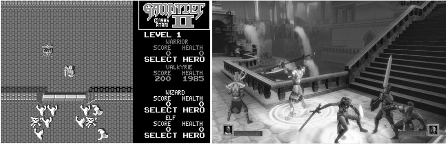
*図: 古典的2Dシューターの例。Robotron: 2084（1982年）は優れたゲームプレイにより長年人気を保った*

**3Dシューター**: HaloやHalf-Lifeシリーズに代表される。2Dシューターよりリアルで、重力・音・影・衝突判定などが現実に近い形で実装される。一人称視点（FPS）と三人称視点の両方がある。

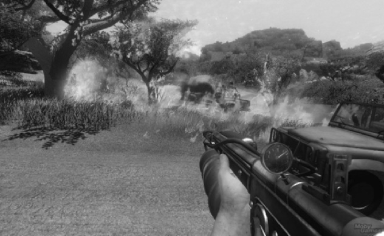
*図: Maze Warから現代の3Dシューターまで、グラフィックスの劇的な進化*

3Dシューターの主な分類:

| 分類 | 特徴 | 代表例 |
|------|------|--------|
| レールシューター | 分岐の少ない一本道。始点から終点まで戦い抜く | Half-Life |
| タクティカルシューター | 現実的な武器・状況。ステルスとカバーが重要 | Ghost Recon |
| サバイバルホラー | リアルなグラフィックで恐怖を演出。探索が大きな役割 | Silent Hill, Resident Evil |
| アリーナゲーム | マルチプレイヤーのデスマッチ・チーム戦に特化 | Quake III: Arena |

#### プラットフォーマー（Platform Games）

プラットフォーマーは、アバターがさまざまな高さのプラットフォームを飛び移りながら障害物を避け、敵と戦うゲームである。超人的なジャンプ力を持ち、高所から落下してもダメージを受けない（危険物や底なし穴を除く）。物理法則は非常に非現実的で、空中で方向転換が可能。Super Mario Bros.が代表例であり、暴力表現が穏やかで子供に適したものが多い。

#### 格闘ゲーム（Fighting Games）

格闘ゲームは探索もシューティングもパズル解きも含まないが、反応速度とタイミングに高い身体的スキルを要求する。アジアの武術をモデルにした誇張された動きで手対手の戦闘をシミュレートする。

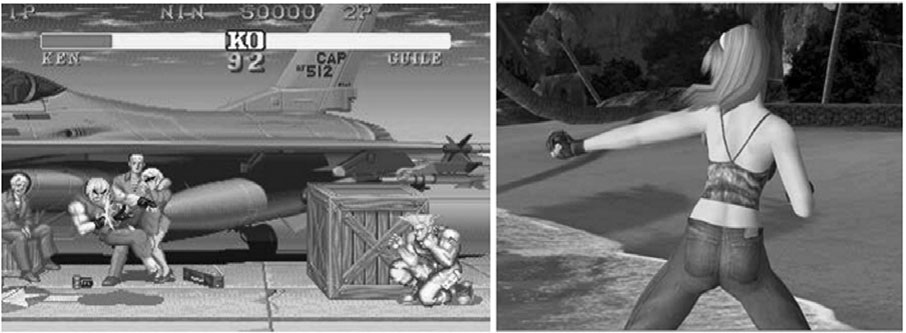
*図: Street FighterとDead or Alive 3。格闘ゲームの進化を示す*

格闘ゲームの重要な特徴:
- **コンボ技**: 特定のボタン・ジョイスティック操作を高速で正確に入力することで発動する強力な攻撃。難易度が高いほど威力が大きい
- **コンボメーター**: コンボ入力の進捗を視覚的に表示するインジケーター
- **じゃんけん的戦略**: 特定の防御は特定の攻撃をブロックするが他はブロックしない。プレイヤーは相手の次の動きを予測しようとする

#### その他のサブジャンル

- **ファストパズルゲーム**: Tetrisに代表される、時間制限のある抽象的パズルゲーム。カジュアルゲーマーに人気
- **アクションアドベンチャー**: アクションとアドベンチャーのハイブリッド。Zeldaシリーズ、Indiana Jones等
- **音楽・ダンス・リズムゲーム**: Dance Dance Revolution、Guitar Hero等。リズム感を試すゲーム

> **キーポイント**: アクションゲームのサブジャンルは多様であり、シューター、プラットフォーマー、格闘ゲーム、パズル、リズムゲームなど幅広い。共通するのは身体的スキルへの依存であるが、求められるスキルの種類はジャンルによって異なる。

---

### 1.3 ゲームの進行構造

#### レベル設計

アクションゲームのレベル進行は**直線的**であることが多い。全レベルをクリアすればゲームクリアとなる。レベルはテーマごとにグループ化され、各テーマの最後には**ボス（Big Boss）**が待ち構えている。

**ペーシングの計画**が特に重要であり、Mike Lopezは9段階のプロセスを提唱している:
1. ブレインストーミング（場所・興奮の瞬間の列挙）
2. 優先順位の設定
3. ストーリーフレームワークの作成
4. キーイベントの強度評価と配列
5. プロットポイントの評価と配列
6. 高強度イベント間の時間設定
7. 全体のトレンド評価
8. レベル構築開始
9. レビューと反復

#### チェックポイント

プレイヤーのアバターが死亡した際に再出現する地点。Sonic the Hedgehogでは、街灯がチェックポイントとして機能し、通過すると白から赤に変わる。

#### レベル出口・ワープ・テレポーター

- **レベル出口**: 次のレベルへの遷移地点。隠されているか敵に守られていることが多い
- **レベルワープ**: 数レベル先にスキップする隠し出口
- **テレポーター**: 同じレベル内の別の場所にジャンプする遷移点

> **キーポイント**: レベル設計においてはペーシング（緩急の配分）が最も重要な原則である。チェックポイントやワープは、難易度の調整と探索のモチベーションを両立させる仕組みである。

---

### 1.4 課題の種類

アクションゲームの課題は主に身体的スキルのテストである。

- **受動的障害物**: 壁や深淵など、移動を妨げるが直接的に攻撃はしないもの
- **固定的危険物**: 電気フェンス、振り子の刃など、近づくと攻撃してくるが移動しないもの
- **能動的危険物（敵）**: 移動しながらアバターを攻撃する存在

**ウェーブ**: 敵が集団で出現する仕組み。スクリプト化されたウェーブ（毎回同じ構成）と、アルゴリズムで生成されるウェーブがある。

**ビッグボス**: テーマレベル群の最後に登場する強敵。通常の方法では倒せず、特殊な武器・攻撃法・タイミングが必要。

**ワイルドカード敵**: ウェーブの予測可能性を崩すためにランダムに出現する敵（Asteroidsの UFO 等）。

**モンスタージェネレーターとスポーンポイント**: 新たな敵を生成する仕組み。Gauntletのように破壊可能なジェネレーターは、プレイヤーに「敵を倒すか、発生源を壊すか」という戦略的選択を与える。

---

### 1.5 コアメカニクスの特徴

アクションゲームのコアメカニクスは**シンプルで明快**であるべきである。プレイヤーは忙しすぎて複雑な内部経済を研究する余裕がない。

| 要素 | 説明 |
|------|------|
| **ライフ** | 通常3〜5回の死亡猶予。敵との衝突で1ライフ失う。パワーアップやスコア到達で追加獲得 |
| **エネルギー（HP）** | ヒットポイントまたはヘルス。危険な遭遇で減少し、枯渇すると死亡 |
| **パワーアップ** | 永続型（ゲーム終了まで持続）と一時型（時間やヒット回数で消滅）がある。強力なほど持続時間は短くすべき |
| **コレクティブル** | スコア加算やシークレットレベル解放に使うボーナスアイテム |
| **タイムリミット** | レベルクリアの制限時間、災害へのカウントダウン、パワーアップの有効期限など |
| **スコア** | プレイヤーの達成度の記録。ハイスコアテーブルで競争を促進 |

#### 特殊アクション

- **スマートボム**: 周囲の全敵を一掃する強力なアクション。使用回数が限られるため、使いどころの判断が重要
- **ハイパースペースエスケープ**: ランダムな場所に瞬間移動。危険回避になるが、さらに悪い状況に陥る可能性もある

> **キーポイント**: アクションゲームのコアメカニクスは少数のリソース（ライフ、エネルギー、スコア等）の単純な関係で構成される。パワーアップやコレクティブルは「リスクと報酬」のバランスを生み出す重要な要素である。

---

### 1.6 カメラモデルとUI

#### カメラモデル

**2Dカメラ**: サイドビューまたはトップダウンビュー。スクロール方式には以下がある:
- **連続スクロール**: 一定速度で自動スクロール。プレイヤーは止められない
- **可変スクロール**: プレイヤーの操作に応じてスクロール。ペースをコントロール可能
- **パララックススクロール**: 背景を前景より遅くスクロールさせ、奥行き感を演出

**3D一人称視点（FPS）**: 高速シューティングに最適。射撃対象がよく見えるが、アバター周囲の視野は狭い（約30度、人間の自然な視野120度の約4分の1）。

**3D三人称視点**: アバターの背後上方からの視点。アバターの周囲が見えるが、遠距離の視認性はFPSに劣る。Resident Evil 4はアバターの右肩越しカメラという革新を導入した。

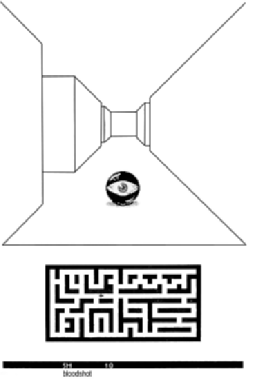

**コンテキスト依存カメラ**: AIによりシーンに応じて最適なアングルを選ぶ。Icoが好例。ただし高速アクション時には混乱の原因になりうる。

#### ユーザーインターフェース設計の原則

- 必要な情報だけを表示する（HUDはミニマルに）
- 重要情報は常に画面上に表示する
- 数値よりグラフィカルインジケーター（パワーバー等）を使う
- 危険な状況では点滅等で注意を引く
- マップはシンプルに。複雑な場合はポーズ画面で表示
- オーディオフィードバックを豊富に使う

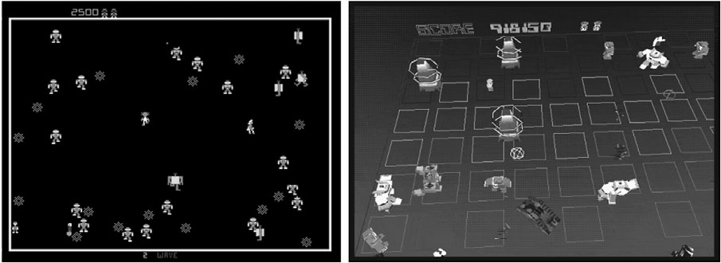

> **キーポイント**: カメラモデルの選択はゲームプレイに直接影響する。2Dは視認性に優れ高速な展開が可能、3Dは環境の活用と驚きの演出に優れる。UIは「可能な限りシンプルに、しかし必要以上に単純にしない」ことが原則。

---

## 2. ストラテジーゲーム

### 2.1 ストラテジーゲームとは

**定義**: ストラテジーゲームとは、提示される課題の大部分が戦略的対立であり、プレイヤーがゲーム中のほとんどの場面で多様な行動・手を選択できるゲームである。勝利は優れた計画と最適な行動の選択によって達成され、偶然の要素は大きな役割を果たしてはならない。

ストラテジーゲームは世界最古のゲームジャンルの一つであり、囲碁（紀元前約2200年）やウルの王朝ゲーム（紀元前約2500年）に遡る。PCゲームとして発展し、コンピュータの計算力を活かした複雑なルールセットの管理が可能となった。

他のジャンルに比べて**対称性が高い**ため、バランス調整が比較的容易である。両陣営に同一またはそれに近いリソースと行動が与えられる。

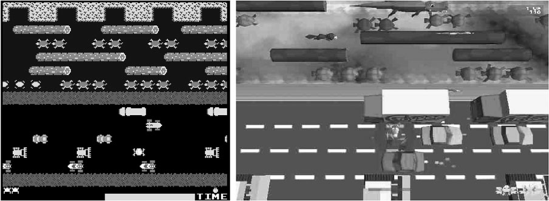

---

### 2.2 ターンベース vs リアルタイム

| 項目 | ターンベース | リアルタイム（RTS） |
|------|-------------|-------------------|
| 時間管理 | プレイヤーが好きなだけ考慮可能 | すべてが同時進行。素早い判断が必要 |
| テンポ | 低速〜中速 | 中速〜高速 |
| 代表例 | Civilization, XCOM, チェス | StarCraft, Age of Empires, Warcraft |
| 特徴 | 深い思考と最適解の探求 | マルチタスクと迅速な意思決定 |
| マルチプレイヤー | 同時ターン制で待ち時間短縮可能 | 自然に同時プレイ |

純粋なストラテジーゲーム（対立のみで経済や物理的課題のないもの）はターンベースである傾向が強い。RTSはターンベースの後に登場し、時間的プレッシャーを追加した。

---

### 2.3 課題の種類

#### 戦略的対立

ストラテジーゲームの中心的課題。戦闘は**ユニット**と呼ばれる個別の戦闘員の間で行われる。ユニットは古代エジプトの戦士から宇宙船まで多岐にわたる。戦闘ユニットの他に、輸送・偵察ユニット、建物型の**工場**（新しいユニットを生産する施設）もある。

ゲームの戦術は設定のリアリズム度合いに応じて、側面攻撃、奇襲、補給線の切断、悪天候の活用など多岐にわたる。

#### 戦闘の代替手段

高度なストラテジーゲームでは、外交・危機管理・諜報が含まれる。Civilization IIIでは外交的交渉が可能で、同盟を結んだり戦争を回避したりできる。Balance of Powerは外交ストラテジーの傑出した例で、冷戦時代の米ソ対立をテーマに、核戦争のリスクを背景にした政治的駆け引きを実現した。

#### 探索の課題

多くのストラテジーゲームは**戦場の霧（Fog of War）**を採用している。これは未探索の領域を黒く、探索済みだが部隊のいない領域を薄暗く表示する手法である。プレイヤーは偵察部隊を送り出して地形を明らかにする必要があり、防御措置を怠ると不意打ちを受ける。

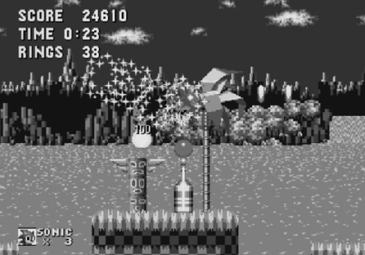
*図: Civilization IIIにおける戦場の霧。明るい領域が現在可視、薄暗い領域が既探索だが未パトロール、黒い領域が未探索*

#### 経済的課題

チェスのように初期ユニット固定のゲームもあるが、多くの現代ストラテジーゲームは**資源の獲得と管理**を含む。Age of Empiresでは食料・木材・石材・金の4資源を採集・管理し、工場の建設やユニットの生産に使用する。

**資源ラッシュの防止**: マップを対称的にレイアウトし、各陣営の近くに同程度の資源を配置する。遠方の資源鉱山はボーナス程度に留め、経済的優位が戦略的スキルを圧倒しないようバランスを取る。

> **キーポイント**: ストラテジーゲームの課題は戦略的対立を中心に、探索・経済・外交が複合的に絡み合う。戦場の霧は緊張感を生み、経済管理はプレイヤーに多層的な意思決定を求める。

---

### 2.4 プレイヤーの行動

ストラテジーゲームにおけるプレイヤーの役割は指揮官・管理者であり、ユニットに命令を出すことが主な行動である。代表的なコマンド:

- **移動**: 指定地点への移動（ウェイポイント経由も可能）
- **攻撃**: 敵ユニットへの攻撃（射程内に入るまで前進し、後退すれば追撃）
- **停止**: 移動・攻撃の中止
- **防衛（Hold）**: 現在位置を保持し、射程内の敵のみ攻撃。追撃しない
- **陣形**: 戦術的に有利なフォーメーションの編成
- **生産**: 資源を消費して新ユニットを作成

その他: 後退（Retreat）、突進（Dash）、パトロール（Patrol）なども一般的。

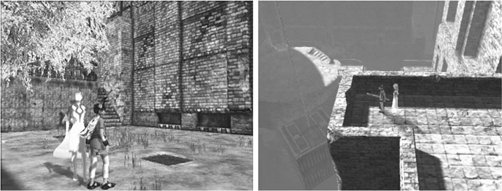

---

### 2.5 コアメカニクス

#### ユニット設計

ユニットは**タイプ**に分類され、同タイプのユニットは共通の属性を持つ。主要な数値属性:

| 属性 | 説明 |
|------|------|
| **HP（ヘルスポイント）** | ダメージを受けると減少。0で破壊 |
| **武器** | ショットパワー（1発あたりのダメージ）、発射速度、弾薬数 |
| **射程** | 武器がダメージを与えられる最大距離 |
| **命中精度** | 0（命中しない）〜1（必中）の値 |
| **回避能力** | 敵の射撃を避ける能力。0〜1の値 |
| **移動速度** | 地形の難易度により実際の速度が変動 |
| **旋回速度** | 新しい方向を向く速さ。瞬時では側面攻撃が無効化される |
| **視界範囲** | 戦場の霧を使用する場合に関係 |

**じゃんけん（RPS）モデル**: The Ancient Art of Warのように、騎士>蛮族>弓兵>騎士という単純な相性関係。シンプルだが複雑なゲームには不向き。現代のゲームでは数値属性から相性関係が自然に生まれるように設計する。

**無敵ユニットの禁止**: 武器の射程と最大速度の両方が全敵ユニットを上回るユニットは設計してはならない。ゲームバランスが崩壊する。

#### 特殊能力

- **ステルス**: 敵に見えなくなる。武器使用時には姿を現すよう設計するのが通例
- **飛行・航行**: 地上ユニットが通れない地形を移動可能
- **修理**: 自己修復またはメディカルユニットによる回復
- **輸送**: 他のユニットを高速で運搬。通常は非武装
- **建設・生産**: 建物の建設や移動ユニットの製造
- **リーダーシップ**: 周囲のユニットに戦闘ボーナスを付与

#### ランチェスターの法則

**線形法則**: 白兵戦では、軍の強さは兵力数に単純比例する。

**二乗法則**: 遠距離射撃戦では、軍の強さは兵力数の**二乗**に比例する。3倍の兵力は9倍の戦力を意味する。これはユニットの**生産速度のバランス**が極めて重要であることを示している。一方がわずかでも多くユニットを生産できれば、その優位性は数の差の二乗で拡大する。

> **キーポイント**: ユニット設計では数値属性のバランスが決定的に重要。ランチェスターの法則は、生産速度のわずかな差が勝敗を大きく左右することを教えている。特殊能力は対抗手段とセットで設計すべきである。

---

### 2.6 アップグレードとテクノロジーツリー

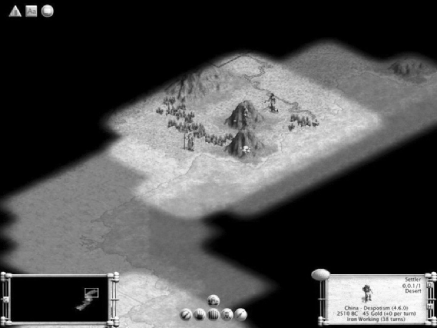
*図: Civilization IIIのテクノロジーツリーの一部。左から右へ研究が進む*

ゲームの進行に伴い、新しいユニットや能力を追加する仕組み:

**アップグレードの種類**:
- **個別ユニットアップグレード**: チェッカーの「キング」のように特定のユニットに適用
- **ユニットタイプアップグレード**: StarCraftのシージタンクのように、同タイプの全ユニットに適用
- **グローバルアップグレード**: Civilizationのフーバーダムのように、社会全体に影響

**永続 vs 一時アップグレード**: ターンベースゲームでは永続型（残りのゲーム全体に有効）、RTSでは一時型（そのレベルのみ有効）が多い。

**テクノロジーツリー**: 多数のアップグレードを分岐するツリー構造に組織化したもの。例えば「蒸気機関」を研究すると「鉄道」「蒸気船」「動力工場」の選択肢が開放される。プレイヤーに戦略的な選択を強いる重要な仕組みである。

---

### 2.7 ロジスティクス（兵站）

実際の戦争では兵站は極めて複雑だが、ゲームでは簡略化される。

- **補給と消耗品**: 食料・燃料は通常無視。弾薬は追跡する場合と無制限の場合がある。原則として「些末な事に煩わされない」
- **補給線**: 部隊と物資の輸送ルート。切断は強力な戦略だが、ゲームでの実装は複雑
- **抽象化**: Warcraftでは食料は農場で生産されるが、全部隊に魔法のように配布される。リアリズムより利便性を優先
- **道路建設**: Civilization IIIでは道路ネットワークが資源分配を制御。道路で接続された町は資源を共有
- **影響マップ**: 補給拠点の一定範囲内にいるユニットにのみ補給が届く仕組み。StarCraftのProtossパワービーコンが好例

> **キーポイント**: ロジスティクスはリアリズムとプレイアビリティの妥協点を見つけることが重要。完全な再現は煩雑すぎるため、道路建設や影響マップなどの抽象化手法が有効である。

---

### 2.8 ゲームワールドの設定

ストラテジーゲームのコアメカニクスは様々な設定に移植可能だが、設定ごとに注意点がある。

| 設定 | 利点 | 注意点 |
|------|------|--------|
| **歴史** | プレイヤーが背景知識を持つ。没入感が高い | 歴史に詳しいプレイヤーの厳しい目。第二次世界大戦は飽和状態 |
| **現代** | リアルな武器と状況 | 実在の紛争を扱うと論争を招く。規模の問題（歩兵 vs ジェット機） |
| **SF（未来）** | 自由な発明が可能 | 用語が直感的でない。規模の問題。技術の一貫性の維持が困難 |
| **ファンタジー** | 魔法による独自の戦闘。親しみやすい | 北欧神話に偏りがち。他文化の民話から着想を得るべき |

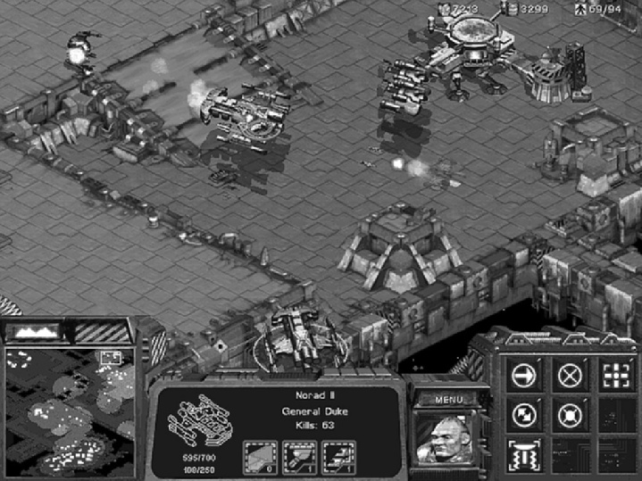

---

### 2.9 AI対戦相手

シングルプレイヤーのストラテジーゲームでは、人工知能（AI）が対戦相手を務める。主な手法:

**ゲームツリー探索**: ターンベースゲーム（チェッカー、チェス等）で使用。将来の手を探索し最も有利な手を選ぶ。選択肢が多いゲーム（囲碁等）では計算量が指数関数的に増大するため限界がある。

**ニューラルネット**: 脳のニューロンの動作を模倣し、成功につながるプレイパターンを学習する。学習に時間がかかり、複雑なパターンには不向き。

**階層的有限状態マシン（hFSM）**: 最も成功している手法。複数のFSM（有限状態マシン）が階層構造を成し、上位が下位に命令を出す。実際の軍隊の指揮系統に似た構造で、「この丘を取れ」という上位目標が「援護射撃」「陽動」といった下位タスクに分解される。

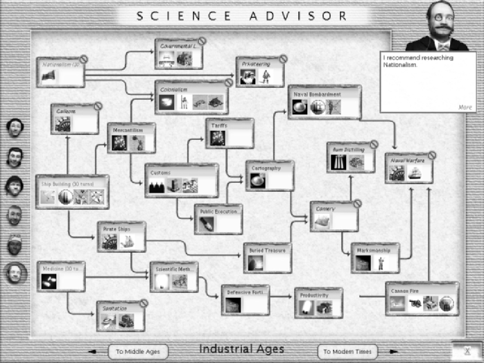

hFSMの利点:
- **創発的行動**: 明示的にプログラムされていない行動が生まれる
- **トップダウン設計**: 大規模戦略を小規模戦略に分解して設計可能
- **汎用性**: 戦闘だけでなく経済目標にも適用可能

> **設計ルール**: AIにユニットをマイクロマネジメントさせてはならない。階層の各レベルでインテリジェントな行動を設計すれば、インテリジェントな結果が自然に生まれる。

> **キーポイント**: AI対戦相手はストラテジーゲームの品質を左右する重要要素。hFSMが最も実用的な手法であり、階層的な命令系統をモデル化することで、大規模な戦場でも合理的な行動を実現できる。

---

## まとめ：2つのジャンルの比較

| 項目 | アクションゲーム | ストラテジーゲーム |
|------|-----------------|-------------------|
| 主な課題 | 身体的スキル（反応・照準・タイミング） | 知的スキル（計画・意思決定・資源管理） |
| テンポ | 高速（ツイッチゲームでは反射レベル） | 低速〜中速（RTSでも戦略的思考が中心） |
| プレイヤーの役割 | アバターの直接操作 | 指揮官として間接的にユニットを管理 |
| コアメカニクス | シンプル（ライフ・スコア・パワーアップ） | 複雑（ユニット属性・生産・テクノロジーツリー） |
| バランス調整 | 非対称で困難 | 対称性が高く比較的容易 |
| 偶然の要素 | 少ない（スキル依存） | 制限すべき（戦略依存）だが命中率等で存在 |

両ジャンルはゲームデザインの基本原則を異なる角度から照らし出す。アクションゲームはプレイヤーの即時的な身体反応を中心に据え、ストラテジーゲームは長期的な計画と意思決定を中心に据える。いずれにおいても、バランスの取れた課題設計とプレイヤーにとって意味のある選択の提供が良いゲームデザインの核心である。
