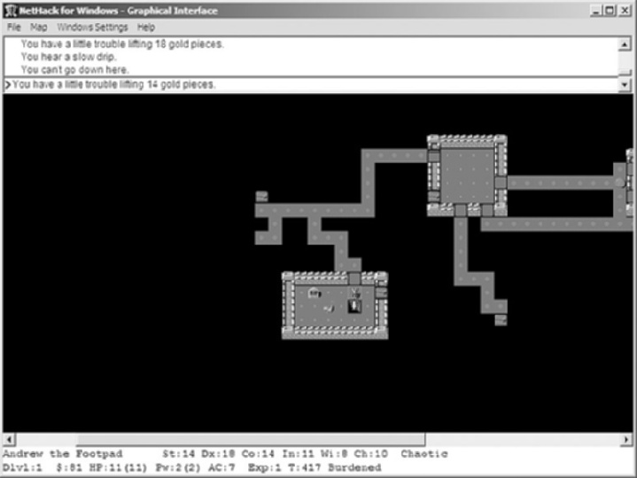
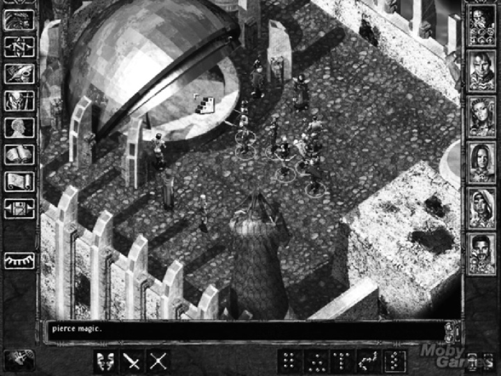
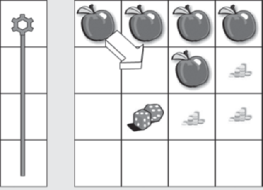
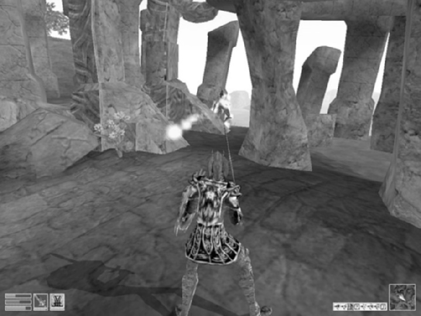
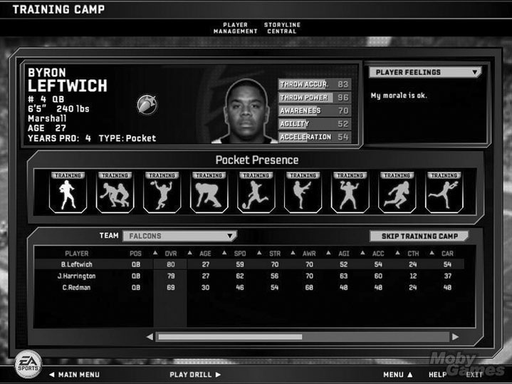

# 第12回：RPGとスポーツゲーム

---

## はじめに

本講では、ゲームジャンルの中でも特に奥深い2つのジャンル――**RPG（ロールプレイングゲーム）**と**スポーツゲーム**について学ぶ。RPGは多様な遊び方と豊かな物語体験を提供するジャンルであり、スポーツゲームは現実のスポーツを忠実にシミュレートしつつ、ビデオゲームならではの楽しさを追求するジャンルである。両者はまったく異なる方向性を持つが、いずれもコアメカニクスの設計が極めて重要である点で共通している。

---

## 第1部：RPG（ロールプレイングゲーム）

### RPGの定義

> **RPGとは**、プレイヤーが1人または複数のキャラクターを操作し、コンピュータが管理する一連のクエストを通じて冒険するゲームである。クエストの達成が勝利条件であり、キャラクターの能力成長がジャンルの核心的特徴である。典型的な課題には、戦術的戦闘、物流管理、経済成長、探索、パズル解決が含まれる。

コンピュータRPG（CRPG）は、『ダンジョンズ&ドラゴンズ』に代表されるテーブルトップRPGから発展した。テーブルトップRPGでは、ゲームマスター（GM）が冒険を演出し、プレイヤーは想像力を駆使してあらゆる行動を提案できる。CRPGではコンピュータがGMの役割を担い、ルールの実装やゲーム世界の表示を行う。コンピュータは即興的なルール変更ができないため柔軟性では劣るが、美しいグラフィックスにより初心者にも親しみやすい。

CRPGの本質的な要素は、**クエスト（物語）**と**キャラクター成長**の2つである。

### RPGの他ジャンルとの比較

RPGは多くのジャンルと要素を共有しており、ハイブリッド作品も多い。

| 比較対象 | 共通点 | 相違点 |
|---------|--------|--------|
| ウォーゲーム | 戦闘ルールの存在 | RPGは少数の異質なキャラクター、ウォーゲームは大量の同質なユニット |
| アクションゲーム | 一部のRPGに物理的挑戦あり | RPGは売買や会話など非アクション要素が豊富 |
| アドベンチャーゲーム | 豊かなストーリーと探索 | RPGはキャラクターを数値属性で定義し、戦闘が中心 |

代表的なハイブリッド作品として、*The Elder Scrolls*シリーズ（アクションRPG）、*Final Fantasy*シリーズ（アドベンチャーRPG）がある。

### ゲームの特徴

#### テーマと進行

CRPGの多くは「あなただけが世界を救える！」という前提で展開される。しかしこれは使い古されたクリシェである。以下のような代替テーマも検討すべきである：

- 愛する人の殺害犯を見つけて罰する
- 隠された出自の秘密を学ぶ
- 誘拐された王子/王女を救出する
- 散逸した魔法のアイテムを再組立する
- 虚偽の告発から自らの潔白を証明する

*Planescape: Torment* は、世界を救うのではなくアバターの過去を発見するという独創的なテーマを採用した優れた例である。

RPGの進行は通常、長大なクエストがエピソードに分割され、各エピソードの終わりにボス戦のような大きな挑戦が待つ線形構造をとる。メインクエストに加え、プレイヤーが自由に受諾・拒否できる**サイドクエスト**がゲームに深みを与える。

#### ゲームプレイモード

CRPGは他のどのジャンルよりも多くの活動を提供する。主要なゲームプレイモードは以下の4つである：

1. **探索と戦闘** -- パーティを操作して世界を探索し、敵と戦う。伝統的なパーティベースRPGではアイソメトリック視点が多い。
2. **会話** -- NPCとの対話をダイアログツリーで管理する。適切な質問により有用な情報や経験値を得られる。
3. **取引** -- 町の商人とアイテムの売買を行う。値段交渉が可能な場合もある。
4. **インベントリ管理** -- キャラクターが持ち歩くアイテムを整理する。重量制限やスペース制限がある。

> **設計上の注意：** インベントリ管理にプレイヤーが過剰な時間を費やすのは好ましくない。矩形パッキング問題（アイテムをグリッドに詰め込む作業）は退屈になりがちであり、自動整理機能やアイテムの回転機能を実装すべきである。

#### キーポイント：RPGのゲーム特徴
- RPGの進行はエピソード型のクエスト構造で、各エピソードの終わりに大きな挑戦がある
- メインクエストとサイドクエストの組み合わせがゲームに深みを与える
- 探索・戦闘・会話・取引・インベントリ管理の5つの活動がRPGの中核をなす
- インベントリ管理のUIはプレイヤーの負担を最小限にする設計が重要

---

### コアメカニクス

#### ダイスロールと確率

RPGの行動判定はダイスロール（コンピュータによるシミュレーション）に基づく。例えば、戦士が扉を破壊するとき、腕力17に対して3個の6面ダイスを振り、合計が腕力以下なら成功する。このメカニクスがRPGの戦闘やその他の活動の基盤となる。

設計者は確率分布を理解する必要がある。3個の6面ダイスで18を出す確率は0.5%未満であり、難易度設定は確率に基づいて慎重に行わなければならない。

#### キャラクター属性

キャラクター属性は**特性属性（Characterization Attributes）**と**状態属性（Status Attributes）**に大別される。

**特性属性**（変化頻度が低い）：

| 属性種別 | 説明 | 例 |
|---------|------|-----|
| 種族（Race） | キャラクターの体型や外見を決定 | 人間、ドワーフ、エルフ |
| 性別 | 体型や関係性に影響（能力制限は設けるべきでない） | -- |
| クラス | 特定の行動やスキルの専門化を決定 | 戦士、魔法使い、盗賊、聖職者 |
| 身体属性 | 移動・戦闘時の能力を決定 | 筋力、器用さ、耐久力 |
| 精神属性 | 学習・推理の能力を決定 | 知性、正気度 |
| 道徳属性 | 善悪の傾向を決定 | 善、悪、中立 |
| 社会属性 | 他者との関係構築能力 | カリスマ、リーダーシップ |

**状態属性**（頻繁に変化する）：

- **HP（ヒットポイント）**：キャラクターの現在の体力
- **経験値（XP）**：成長の度合いを測る指標。敵の撃破やクエスト達成で獲得
- **キャラクターレベル**：XPが一定値に達するとレベルアップし、属性を強化できる

> **設計ルール：** HPが低いキャラクターの戦闘能力を減少させてはならない。先制攻撃が圧倒的に有利になり、ゲームバランスが崩れる。

#### 魔法システム

魔法（またはサイキックパワー、先端技術など）は、RPGの特徴的な要素である。一般に魔法使い専用のクラスに制限され、物理戦闘と魔法戦闘の補完関係がパーティ編成の動機となる。

魔法の制限方法として現在主流なのは**マナシステム**である。各呪文にマナコストが設定され、キャラクターのマナが尽きるまで自由に呪文を組み合わせて使用できる。マナはポーション消費や時間経過で回復する。

#### スキルツリー

キャラクターは時間の経過とともに新しいスキルを習得できる。スキルは通常、ツリー構造（スキルツリー）で整理され、基礎スキルを習得することで上位スキルが解放される。

スキルの習得方法には、経験値による自動獲得と、メンターNPCからの有料学習がある。戦略ゲームのユニットアップグレードとは異なり、RPGのスキルはキャラクター個人に永続的に帰属する。

#### キーポイント：RPGのコアメカニクス
- ダイスロールベースの確率判定がすべての行動の基盤
- キャラクター属性は特性属性（変化頻度低）と状態属性（変化頻度高）に分かれる
- 経験値とレベルアップがキャラクター成長の中心的仕組み
- マナシステムによる魔法の制限が現在の主流
- スキルツリーにより段階的な能力獲得を実現

---

### ゲームワールドとストーリー

#### 設定（セッティング）

CRPGの世界はファンタジーやSFの設定が多い。その理由は：

1. 魔法や先端技術により、現実では不可能な体験を提供できる
2. 多様な敵やモンスターを登場させられる
3. キャラクターの非現実的な急速な成長をより自然に見せられる

ただし、現代を舞台にしたRPG（警察官やスパイが新しいスキルを獲得していく物語）も十分に成立する。設定がどのようなものであれ、RPGはスローペースのゲームであるため、**探索して楽しい魅力的な世界**を構築することが不可欠である。

#### ストーリー設計

CRPGのストーリーは映画よりもはるかに長く、長編小説に匹敵する。設計の手順は以下の通り：

1. **全体クエスト（エンディング）を決定する** -- 序盤のクエストは最終目的と異なることが多い（偽の目的からの転換）
2. **エピソードごとの旅程を設計する** -- 各エピソードは異なる地域で展開
3. **プロットの転換点を配置する** -- 失われた親族の出現、敵が味方に転じる展開など
4. **サイドクエストを追加する** -- メインクエストの間接的支援となるものが望ましい
5. **オープニングの演出を設計する** -- 謎と誘引のバランスが重要

*Fallout* のオープニングは優れた例である。地下シェルターの浄水チップを探すという単純な任務から始まるが、次第に複雑化し、最終的にシェルター全体の存亡をかけた冒険へと発展する。

#### プレゼンテーション層

- **インタラクションモデル**：多くのCRPGはパーティベース。少数のゲーム（Diabloなど）はアバターベース
- **カメラモデル**：アバターベースでは一人称/三人称視点、パーティベースではアイソメトリックまたは俯瞰視点が一般的

CRPGのユーザーインターフェースは他のジャンルよりも複雑で、ミニマップ、体力表示、戦闘オプション、パーティポートレート、モード切替ボタンなどが同時に表示される。

#### キーポイント：ゲームワールドとストーリー
- ファンタジー/SF設定は急速なキャラクター成長を自然に見せる効果がある
- ストーリーは単純なクエストではなく、謎解きと転換点を含む長編構造にする
- サイドクエストはメインクエストを間接的に支援する内容が望ましい
- オープニングは謎と動機のバランスが鍵

---

## 第2部：スポーツゲーム

### スポーツゲームの定義

> **スポーツゲームとは**、現実または架空のスポーツの何らかの側面をシミュレートするゲームである。試合のプレイ、チームやキャリアの管理、またはその両方を含む。試合プレイは身体的・戦略的チャレンジを用い、マネジメントは主に経済的チャレンジである。

スポーツゲームは他のジャンルとは異なり、プレイヤーが**すでによく知っている世界**を再現する。そのため、現実との直接的な比較が避けられず、ファンは逸脱を欠陥と見なす。一方で、*Mutant League Football* のようなファンタジー系や、*Blitz* シリーズのような誇張系の作品も存在する。

### ゲーム構造とプレイヤーの役割

スポーツゲームの主要なゲームプレイモードは**試合プレイ（マッチプレイ）**であり、その外側にチーム管理機能がある。

**プレイヤーの3つの役割：**

| 役割 | 内容 |
|-----|------|
| **選手** | 試合中にアスリートを操作。チームスポーツでは操作対象が状況に応じて切り替わる |
| **コーチ** | 先発メンバーの選定、攻守の戦略設定、選手交代を行う |
| **ゼネラルマネージャー** | 選手の雇用・解雇・トレード、チームの長期的強化を担当 |

### 競技モード

スポーツゲームはあらゆる競技形態を提供する：

- **シーズンモード** -- 1シーズンを通じてチャンピオンシップを目指す
- **エキシビションモード** -- 1試合限りの対戦
- **サドンデス** -- 最初の得点で勝敗が決まる短時間モード
- **ラウンドロビン** -- 総当たり戦
- **トーナメントモード** -- 敗退制のトーナメント
- **フランチャイズモード（ダイナスティモード）** -- 数シーズンにわたりチームを育成。個人競技では**キャリアモード**と呼ばれる

また、スポーツゲームに特有の「コンピュータ同士の対戦」モードも重要である。プレイヤーが試合を観戦したり、プレイしたくない試合を自動シミュレートする際に使用される。

#### キーポイント：スポーツゲームの構造
- 試合プレイが中核、管理機能が補完する二層構造
- プレイヤーは選手・コーチ・GMの3役割を担う
- シーズン、フランチャイズなど多様な競技モードが長期的プレイを支える
- コンピュータ同士の対戦モードはシーズン制ゲームで不可欠

---

### コアメカニクス

#### 物理シミュレーション

スポーツゲームの物理エンジンは、試合中の物体と人体の挙動を決定する。ボールの物理挙動は比較的単純だが、人体の物理挙動は複雑である。現代のスポーツゲームは路面の摩擦係数（雨天時の滑り）なども考慮する。

**重要な設計原則：** 物理シミュレーションは「できるだけリアル」であるべきではない。その理由は2つある：

1. プレイヤーはフィールドにいるのではなく、コントローラーを通じて操作している
2. プレイヤーはプロ選手ではない（時速95マイルの投球に対するバットのスイングタイミングは約0.04秒）

物理を現実と完全に一致させるのではなく、プロスポーツの**合理的なシミュレーション**に見えることが重要である。

#### 選手レーティング

選手の能力評価は、物理エンジンにデータを供給するために不可欠である。

**共通レーティング：**
- スピード、俊敏性、体重、加速力、跳躍力、持久力、怪我耐性

**ポジション別レーティング（例：アメフトのQB）：**
- パス距離、パス精度、手先の器用さ、状況認識力

#### 選手AI

スポーツゲームのAIは、アクションゲームの敵AIとは根本的に異なる。各選手は**チームの集団目標**に基づいて知的に行動しなければならない。

AI設計の手順：
1. **状態空間を定義する** -- 試合のルールと戦術に基づいてゲーム状態を洗い出す（例：サッカーのコーナーキックは「キック前」「ボール空中」「他の選手に触れた後」など複数の状態に分かれる）
2. **集団目標と個人目標を設定する** -- 各状態における各選手の役割を決定
3. **具体的な行動を定義する** -- 移動方向、アニメーションなどを指定

> 何もしていない選手にも「フィジェット」（体重移動やストレッチなどの待機アニメーション）を入れ、プレイ中はアクションの方を向かせるべきである。

#### アーケードモード vs シミュレーションモード

- **アーケードモード** -- アクションを増やしリアリズムを犠牲にする（例：打率を.333から.500に引き上げ）
- **シミュレーションモード** -- 現実に忠実な再現を優先

設計上は、**まずシミュレーションモードを完成させ**、次にアーケード向けの調整を行うべきである。

#### キーポイント：スポーツゲームのコアメカニクス
- 物理シミュレーションは「リアル」より「プレイアブル」を優先する
- 選手レーティングは共通属性とポジション別属性の二層で構成
- AIは状態空間の定義→集団/個人目標の設定→具体行動の定義の順で設計
- アーケード/シミュレーションの切り替えはプレイヤー層の幅を広げる

---

### プレゼンテーション層

#### インタラクションモデルとカメラ

スポーツゲームでは、プレイヤーの操作対象が試合状況に応じて**自動的に切り替わる**。例えばバスケットボールではボールを持つ選手に操作が移る。この切り替わりに伴い、UIのボタン機能も刻々と変化する。

**カメラの指針：**
- 一対一の競技ではアスリートの動きが見える視点を選ぶ（一人称は避ける）
- チーム競技ではやや高い位置からのサイドビューまたはエンドビューが有効
- 野球のように焦点が2つに分かれる競技では**ピクチャー・イン・ピクチャー**方式が有効

#### 音声解説（オーディオコメンタリー）

TVスポーツの実況を再現するため、多くのスポーツゲームは音声解説を実装する：

- **実況アナウンサー** -- プレイごとの状況を逐一解説
- **解説者** -- 戦術面の分析や選手の背景情報を提供
- **スタジアムアナウンサー** -- 場内放送

解説を設計するには、実際のTV中継を録画して書き起こし、どのイベントがどの種類のコメントを引き起こすかのパターンを分析する。プログラマーと連携して、ソフトウェアが検出可能なイベントに基づいてコメントを設計する。

#### 天候とインスタントリプレイ

**天候**は試合に直接影響する。雨や雪はトラクションを低下させ、暑さは選手の疲労を早める。

**インスタントリプレイ**はスポーツゲームに不可欠な機能であり、以下の操作が必要である：
- 再生・停止・早送り・巻き戻し・コマ送り
- カメラの3次元移動と角度調整
- 特定の選手やボールへのカメラロック

#### ライセンスと権利

スポーツゲーム開発には法的配慮が不可欠である：

- **チーム・リーグの商標** -- リーグの許諾なしにチーム名やロゴは使用不可
- **選手の肖像権** -- 個人のパブリシティ権の取得が必要
- **写真の著作権** -- 撮影者と被写体双方の許諾が必要

ライセンス取得は高コスト・長期間を要するため、それがなくても成立するゲーム設計を考慮すべきである。

#### キーポイント：スポーツゲームのプレゼンテーション
- 操作対象の自動切り替えとUIの動的変更がスポーツゲーム特有の課題
- 音声解説はTV中継のパターン分析に基づいて設計する
- インスタントリプレイはプレイヤー体験と販促素材の両面で重要
- ライセンス・権利問題は開発初期から計画に組み込む

---

## まとめ

### RPGとスポーツゲームの比較

| 観点 | RPG | スポーツゲーム |
|------|-----|--------------|
| プレイヤーの知識 | ゲーム世界を新たに学ぶ | 現実のスポーツの知識を持っている |
| コアメカニクス | ダイスロール・属性・スキルツリー | 物理シミュレーション・選手レーティング |
| 主要な課題 | 戦闘・探索・パズル・経済 | 身体的操作・戦略・チーム管理 |
| 物語の重要度 | 極めて高い | 低い（シーズン展開が物語の代替） |
| キャラクター成長 | ジャンルの中核 | レーティングの微調整にとどまる |
| UI複雑度 | 非常に高い | 状況依存で動的に変化 |

両ジャンルに共通するのは、**コアメカニクスの綿密な設計**がプレイヤー体験の質を決定するという点である。RPGではキャラクター属性と確率計算の設計が、スポーツゲームでは物理シミュレーションとAIの設計が、ゲームの成否を左右する。

---

*本資料は Ernest Adams『Fundamentals of Game Design』第15章・第16章に基づく。*
