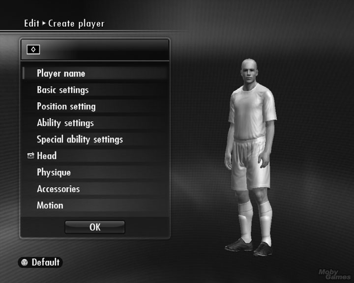
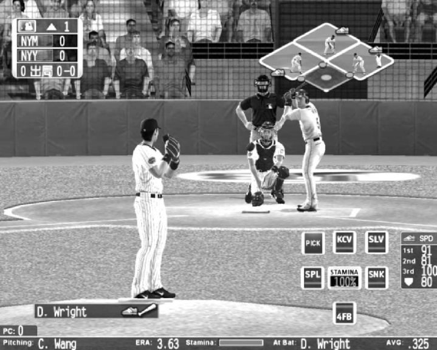
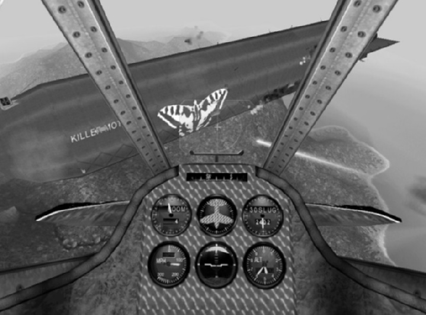
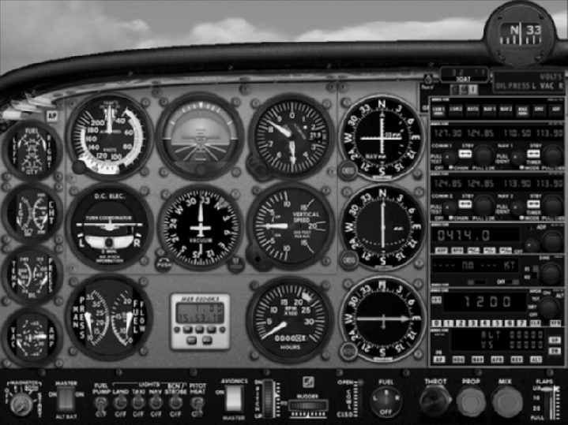
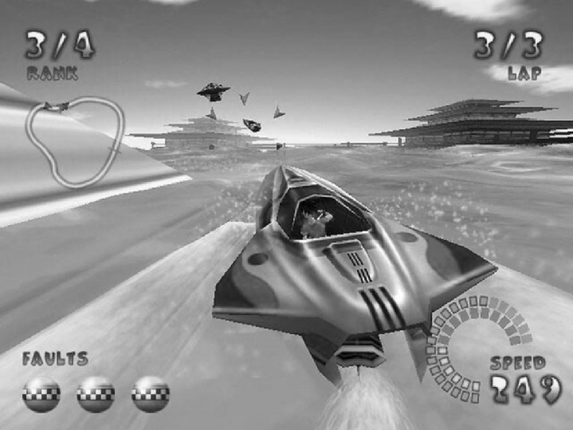
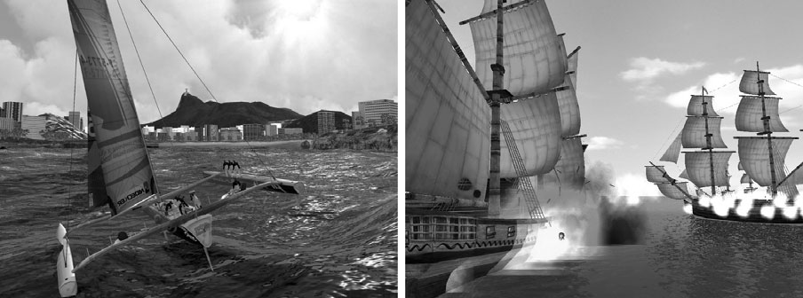
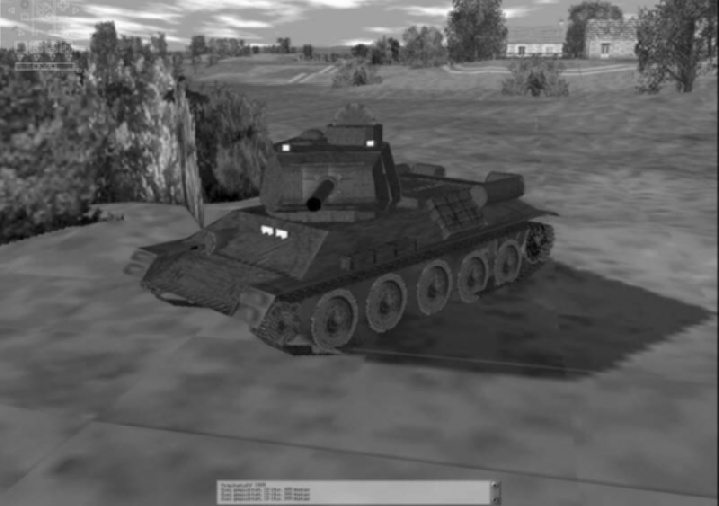
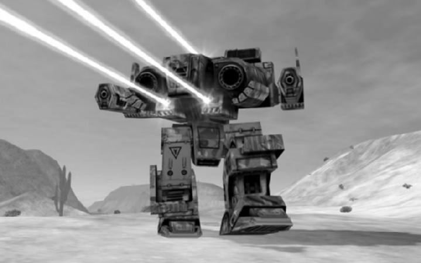

# 第13回：乗り物シミュレーションと建設・経営シミュレーション

---

## 第1部：乗り物シミュレーション（Vehicle Simulations）

### 1.1 乗り物シミュレーションとは

乗り物シミュレーションとは、実在または架空の乗り物を操縦する感覚を再現するゲームジャンルである。空・地上・水上・宇宙といった多様な環境を舞台に、レース、探索、戦闘などの体験を提供する。

このジャンルの最大の特徴は**真実らしさ（verisimilitude）**の追求にある。プレイヤーは実際に運転・操縦しているかのような感覚を期待する。私たちの多くは自動車の運転経験があるため、時速200kmでの走行や武装車両の操作といった非日常の体験であっても、「本物らしさ」に対する基準を持っている。

一方、架空の乗り物を扱う場合は、重力やG、燃料容量などの現実的制約から自由に、移動の感覚そのものを自在にデザインできる。

### 1.2 ゲームの特徴

#### フライトシミュレーター

フライトシミュレーターは大きく**民間機**と**軍用機**の2種類に分かれる。

- **民間フライトシム**：航空機の外観と性能の再現に重きを置き、戦闘要素はない。Microsoft Flight Simulatorが代表例で、夜間飛行、悪天候、計器飛行など多様な状況での操縦を体験できる。着陸が最も困難なチャレンジとなる。
- **軍用フライトシム**：操縦に加え、敵機や地上施設への攻撃といったミッション遂行が求められる。現代の長距離ミサイル戦よりも、第一次・第二次世界大戦のドッグファイト（近接空中戦）が人気を保っている。

*図1：Crimson Skiesのパイロット視点。シンプルな計器パネルが特徴的*

#### ドライビングシミュレーター

ドライビングシミュレーターも2つのカテゴリに分かれる。

- **実在レースの再現**：IndyCar、NASCAR、Formula 1などの公式レースを模擬する。公式名称やロゴの使用にはライセンスが必要。
- **架空のレース**：都市や田園地帯、ファンタジー環境を舞台にした自由なレースゲーム。

#### プレイヤーの分類

プレイヤーは**ピュアリスト（純粋主義者）**と**カジュアルプレイヤー**に大別される。ピュアリストはフラップの戻し忘れによる損傷まで再現することを求めるが、カジュアルプレイヤーは細部よりも「速く飛び回り、撃ちまくる」体験を重視する。この両者のバランスをどう取るかが設計上の重要な判断となる。

#### 競技モード

乗り物シミュレーションでは以下の競技モードが一般的である。

| モード | 内容 |
|--------|------|
| シングルプレイヤー | AI対戦相手との対戦 |
| マルチプレイヤー | デスマッチ、レース |
| キャリアモード | パイロット/ドライバーの経歴を追う |
| キャンペーンモード | 一連のミッションまたはレースシリーズ |

> **キーポイント：乗り物シミュレーションの特徴**
> - 真実らしさ（verisimilitude）の追求がジャンルの核心
> - 民間／軍用、公式レース／架空レースの分類が基本
> - ピュアリスト向けのリアリズムとカジュアル向けの簡略化のバランスが設計の鍵
> - キャリアモードやキャンペーンモードが継続的なプレイ動機を提供する

---

### 1.3 コアメカニクス：物理モデルと操作感

乗り物シミュレーションのコアメカニクスは**ほぼ全てが物理演算**に基づく。エンターテインメントの価値の多くは「本物の機械を操縦している感覚」から生まれるため、車両の徹底的なリサーチが不可欠である。

#### 操作の妥協点

現実の乗り物を家庭用の入力デバイス（コントローラー、キーボード、マウス）で操作する以上、妥協は避けられない。特にB-52爆撃機のような大型複雑機体では顕著である。ターゲット層がピュアリストかカジュアルかによって、妥協の度合いが変わる。

#### 飛行の簡略化

軍用フライトシムでは以下の簡略化が一般的である。

- **コックピット計器の削減**：実機の膨大な計器を必要最小限に絞る
- **ナビゲーションの簡略化**：天測航法の代わりにマップを提供
- **自動協調飛行（Coordinated Flight）**：通常はエルロンとラダーを個別操作する必要があるが、ジョイスティックの左右で両方を同時制御し、自動的に協調旋回を実現する

#### 速度感の演出

ドライビングシミュレーションでは速度感の表現が極めて重要である。主な手法は以下の通り。

- **路面テクスチャの変化**：道路を均一な黒ではなく、連続的に変化する濃淡で表現する
- **路側のオブジェクト**：木、標識、橋など垂直に立つ物体を配置し、通過感を演出
- **サウンド**：エンジン音、路面ノイズ、風切り音、ドップラー効果
- **スピードメーター/タコメーター**：論理的な速度認知を補助

*図2：GT Legendsのトラックサイドビュー。路面テクスチャの変化が速度感を生む*

#### AI対戦相手の設計

対戦相手の多様性を生み出す方法は2つある。

1. **車両性能の差異**：登坂力、旋回性能、最高速度など車両パラメータを変える
2. **ドライバー行動の変動**：「完璧なAI」をベースに、ギアチェンジのタイミングやライン取りにばらつきを持たせる

この2つの組み合わせ（車両特性 x ドライバースキル）が対戦相手のバリエーションを生む。

#### ダメージモデル

ダメージの扱いは3段階に分けて考えられる。

| レベル | 方式 | 適用例 |
|--------|------|--------|
| 簡易 | ダメージなし（衝突時はバウンド） | カジュアル・子供向け |
| 中間 | 単一HP値で管理 | 携帯端末向け等 |
| 詳細 | 部位別ダメージ＋性能への影響 | 本格シミュレーション |

> **キーポイント：コアメカニクス**
> - 物理演算がゲームプレイの基盤。リサーチと妥協のバランスが設計の本質
> - 飛行の簡略化（計器削減、自動協調飛行等）でアクセシビリティを確保
> - 速度感は視覚（路面・路側物）と聴覚（エンジン音・ドップラー効果）で演出
> - AI対戦相手は「完璧からの偏差」で個性を表現する

---

### 1.4 その他の乗り物と知的財産権

#### 多様な乗り物

飛行機と自動車以外にも、様々な乗り物シミュレーションが存在する。

- **ボート・船舶**：パワーボートやジェットスキーは自動車と似た速度感を提供するが、流体中を動くため旋回特性が異なる。潜水艦シミュレーション（Silent Hunter IIIなど）は三次元移動と潜望鏡・魚雷発射のドラマ性で人気がある。
- **戦車・メック**：戦車は回転砲塔が特徴的で、移動方向と射撃方向が独立するUIの設計が課題となる。メック（MechWarriorなど）はSFの架空兵器であり、現実の制約に縛られない自由な設計が可能。
- **宇宙船**：実在の宇宙船は動きが遅すぎるため、ほとんどがSF設定。Wing Commanderのような戦闘機タイプとStar Trekのような大型艦タイプに分かれる。

*図3：Jetboat Superchamps。ボートレースのサードパーソン視点*

#### 知的財産権（IP）

- **軍用車両**：一般消費者向けに販売されていないため、製造元の許可なく描写・シミュレーションが可能
- **自動車**：実在の車名やロゴを使用するにはメーカーからのライセンスが必要。さらに、車両が大破・炎上する描写を制限される場合もある。Interstate '76のように「似ているが別の車」を作る回避策もある

### 1.5 プレゼンテーション層

#### カメラモデル

乗り物シミュレーションでは複数のカメラ視点を提供するのが標準的である。

**飛行・ドライビング共通の視点：**
- **パイロット/ドライバー視点**：コックピット内からの一人称視点（デフォルト）
- **コックピット除去視点**：計器を省略し、前方を全画面表示
- **チェイスビュー**：車両後方からの追従視点
- **前後左右の外部視点**：四方からの固定視点
- **フリーカメラ**：リプレイ用の自由視点

**ドライビング固有の視点：**
- **トラックサイドビュー**：コース脇の固定カメラ（TV中継風）
- **観客席ビュー**：ゴールライン正面
- **飛行船ビュー**：上空からの俯瞰

#### UIデザインの課題

最大の課題は、実車両の複雑な操作系を家庭用デバイスにマッピングすることである。モーションセンサー付きコントローラー（傾きでステアリング）は有効だが、90度以上の回転は要求すべきではない。フォースフィードバック対応のハンドルやペダルはサポートすべきだが、**標準コントローラーだけでも楽しめる設計**が必須である。

> **キーポイント：プレゼンテーション層**
> - 複数のカメラ視点の提供が標準。プレイ用とリプレイ鑑賞用を分ける
> - 軍用車両はIP問題が少ないが、民間自動車はライセンスが必要
> - 特殊コントローラー対応は歓迎されるが、標準入力での快適さが最優先

---

## 第2部：建設・経営シミュレーション（Construction and Management Simulations）

### 2.1 建設・経営シミュレーションとは

建設・経営シミュレーション（CMS）は、経済的制約の中で何かを「建てる」ゲームである。プレイヤーの目標は敵を倒すことではなく、進行中のプロセスの中でより良い建設を行うことにある。

> **定義：** CMSとは、課題の大部分が経済的なもので、成長に関わるゲームである。建設活動が不可欠な要素であり、パターン認識や探索の課題も含まれることがある。物理的な操作やコンフリクトの課題は、他ジャンルとのハイブリッドでない限り回避される。

SimCityが最初の成功したCMSであり、高速アクションや暴力なしでもコンピュータゲームが成功できることを証明した。CMSは通常、**自由建設モード**と**シナリオモード**の両方を備える。

### 2.2 ゲームの特徴

#### プレイヤーの役割

CMSにおけるプレイヤーの役割は、現実の職業に直接対応しない場合が多い（市長が個人的に道路を引いたりゾーニングを行ったりはしない）。CMSの魅力は「自分だけのものを作る」という創造の欲求に応えることにある。ティベル川のほとりの小さな集落を壮大なローマに育てる――それはデザイナーのローマでも歴史のローマでもなく、プレイヤー自身のローマである。

#### 進行と勝利条件

CMSの多くは他ジャンルと異なり、レベル間の進行やストーリーを含まない。明確な勝利条件が設定されないことも多く、敗北条件（典型的には破産）を回避する限りゲームは永続する。勝利条件を設ける場合は、自由建設モードよりもシナリオの中で「資産総額50億ドル到達」のような達成目標を設定するのが効果的である。

#### 間接的コントロール

CMSの大半は**間接的コントロール**のゲームである。ウォーゲームでは兵士に直接「ここへ行け」と命令するが（直接的コントロール）、CMSではプロセスを限定的にしか変更できず、試行錯誤を通じて変更の影響を学んでいく。例えば、価格を下げる行為自体は直接的だが、それによる売上増加は間接的コントロールの結果である。

*図4：オリジナルSimCity。低性能マシン向けに設計されたため、内部経済が理解しやすい*

#### SimCityの経済モデル

SimCityの基本メカニズムを例に、CMSの構造を理解する。

1. **ゾーニング**：土地を住宅・商業・工業の3種に区分（コスト発生）
2. **人口流入**：ゾーンに住民（Sims）が移り住み、税収が発生（正のフィードバック）
3. **インフラ需要**：電力（発電所・送電線）、交通（道路・鉄道）が必要
4. **公共サービス**：消防署、警察署の建設・維持
5. **人口閾値による要求**：一定の人口に達するとスタジアムや空港を要求される
6. **バランス機構**：インフラやサービスへの支出が正のフィードバックを抑制する

> **キーポイント：CMSの基本特徴**
> - 「敵を倒す」のではなく「プロセスの中で建設する」ゲーム
> - 間接的コントロールが中心。プレイヤーは試行錯誤で影響を学ぶ
> - 勝利条件なしで永続するデザインも一般的
> - 創造の欲求に応えることがCMSの魅力の源泉

---

### 2.3 コアメカニクス：リソースフローの設計

CMSは他のどのジャンルよりも多くのリソースを扱う。

#### 主要リソース

| リソース | ソース（供給源） | ドレイン（消費先） |
|----------|------------------|-------------------|
| 資金 | 住民への課税、金鉱 | 購入・建設 |
| 人口 | 移住・出生 | 移出・死亡 |
| 食料 | 農場 | 住民の消費 |
| 労働力 | 人口 | 建設活動 |
| 土地 | 環境に存在（探索で取得） | 消失しないが有限 |
| 建設資材 | 環境から採取（木材等） | 建設で消費 |
| 建物 | 資金＋資材＋労働力で建設 | 解体・災害で消失 |

#### 建設メカニズムの2類型

- **購入即配置（Purchase-and-Place）**：資源を消費して即座にオブジェクトが出現する。SimCityはこの方式で、ゾーニングや施設建設が瞬時に行われる。建設が主活動のゲームに適する。
- **計画建設（Plan-and-Build）**：建設エリアを指定すると、時間をかけて建設が進む。建設中の建物が半透明で表示されることもある。The Settlersシリーズでは木材や石材を少しずつ運搬する必要があり、リソースフロー管理の負担と引き換えに、より細かいコントロールを提供する。

*図5：Bridge Itでは、実際に荷重を支えられる橋を建設する必要がある*

#### ドレインとメンテナンス

ドレインはリソースをゲームから恒久的に除去する仕組みである。

- **劣化（Decay）**：建物や道路が摩耗し、修繕が必要になる（SimCityの道路舗装など）
- **メンテナンスコスト**：自動化された維持費。プレイヤーは支払うだけだが、建設利益の無限蓄積を防ぐ重要なバランス機構
- **災害（Disaster）**：火災、竜巻、モンスター襲来など、プレイヤーに即時対応を迫るイベント

*図6：Theme Park World。アドバイザーキャラクターが画面右下でプレイヤーを補助する*

#### アドバイザーとマインドリーディング

CMSでは、プレイヤーが全体を監視しきれない問題を補うツールが重要である。

- **アドバイザー**：問題発生時にポップアップで警告するキャラクター。緊急事態の通知やグローバルな状態の報告を行う。閾値の設定が重要で、低すぎると煩わしくなる。
- **マインドリーディング**：個々のシミュレーション住民をクリックして、内部状態（目標、幸福度等）を確認できる機能

> **キーポイント：コアメカニクス**
> - リソースの「ソース→コンバーター→ドレイン」の流れがCMSの骨格
> - 購入即配置と計画建設の2方式はゲームの性質に応じて選択
> - メンテナンスと災害がリソースの無限蓄積を防ぐバランス装置
> - アドバイザーやマインドリーディングがプレイヤーの情報負荷を軽減

---

### 2.4 ゲームワールドとプレゼンテーション

#### ゲームワールドの設計

CMSはプロセスのゲームだが、プロセスを画面上に意味ある形で表示し、プレイヤーの想像力を刺激する必要がある。多くのCMSは屋外空間を上空から見下ろす構成を取る。

- **2D/2.5D**の世界が多く、3Dエンジンを使用していても視点はアイソメトリック（斜め見下ろし）が一般的。水道管を敷設する際に地下鉄との交差を気にする必要がないなど、第三次元の省略がプレイヤーの計画に集中する助けとなる。
- 3D環境ではズームイン/アウトと自由なカメラ移動が可能で、全体俯瞰とローカル問題への注目を切り替えられる。

*図7：Capitalism II。SimCity風の都市ビューと経営要素を組み合わせた大規模ビジネスシミュレーション*

#### プレゼンテーション層

CMSの視覚表現は**創造性と成長**のテーマにふさわしい明るさを持つべきである。霧や暗闘、影は不要で、ベルギーの漫画家エルジェの「リーニュ・クレール」スタイル（明確な線、フラットな影、均一な照明）が参考になる。

#### インタラクションモデル

プレイヤーは通常**マルチプレゼント**（世界全体を見渡せる状態）であり、アバターは持たない。ただしDungeon Keeperのように、一時的にクリーチャーの視点で歩き回れるウォークスルーモードを提供するゲームもある。これは娯楽性を高めるが、経営面では不要な機能である。

#### ハイブリッドゲーム

CMSとウォーゲームを融合したハイブリッドゲームも存在する。Civilization、Dungeon Keeper、The Settlersなどが代表例である。

ハイブリッド設計の原則：**経済シミュレーションを先に設計し、その後に他の要素を追加する**。経済設計の誤りは他の全ての要素に波及するためである。例えば、武器生産が速すぎると、プレイヤーは戦略より物量で敵を圧倒してしまう。

#### 純粋ビジネスシミュレーション

建設を伴わず、経済プロセスのみを扱うジャンルもある。Hollywood Mogul（映画ビジネス）やMr. Bigshot（株式市場）などが例である。数値中心のゲームプレイを視覚的に魅力あるものにすることが設計上の最大の課題で、アニメーション、ナレーション、音楽などの演出が重要となる。

*図8：Mr. Bigshot。建設要素のない純粋なビジネスシミュレーション*

*図9：Capitalism IIでは製品とその原材料の視覚化が経営判断を支援する*

> **キーポイント：ゲームワールドとプレゼンテーション**
> - アイソメトリック視点で2D/2.5Dの世界を見下ろすのが定番
> - 明るく清潔な視覚スタイルが創造性のテーマに合致
> - ハイブリッド設計では経済シミュレーションの設計を最優先にする
> - 純粋ビジネスシムでは数値のゲームプレイを視覚的に魅力的にする工夫が必要

---

## まとめ：2つのシミュレーションジャンルの比較

| 比較項目 | 乗り物シミュレーション | 建設・経営シミュレーション |
|----------|----------------------|--------------------------|
| 核心的体験 | 操縦の真実らしさ | 建設と成長の創造性 |
| 主要な課題 | 物理的操作・反射神経 | 経済的判断・リソース管理 |
| コアメカニクス | 物理演算モデル | リソースフロー（ソース/ドレイン） |
| コントロール | 直接的（車両を直接操作） | 間接的（プロセスに影響を与える） |
| 視点 | 一人称／チェイスビュー | 俯瞰／アイソメトリック |
| 勝利条件 | レース順位、ミッション達成 | 多くの場合なし（敗北条件のみ） |
| 対象プレイヤー | ピュアリスト〜カジュアル | 創造的実験を好むプレイヤー |

両ジャンルに共通するのは、**シミュレーション（模擬）としての説得力**が求められることである。乗り物シムでは物理的な真実らしさが、CMSでは経済プロセスの論理的な一貫性が、それぞれプレイヤーの没入感を支えている。

---

*本教科書は Ernest Adams『Fundamentals of Game Design』第17章・第18章に基づく*
