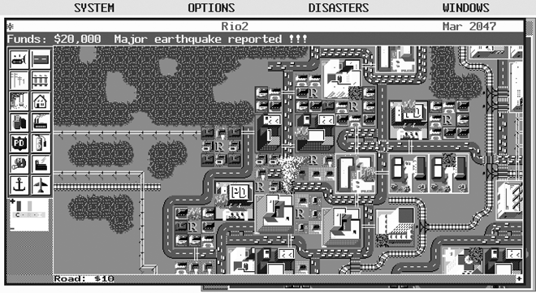
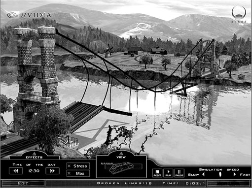
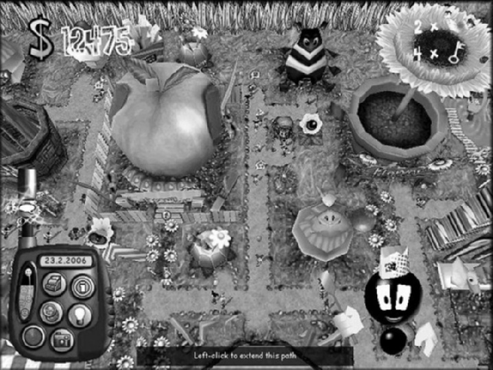
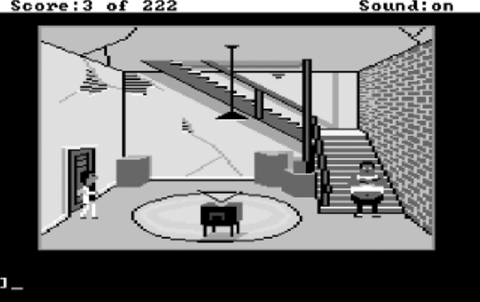
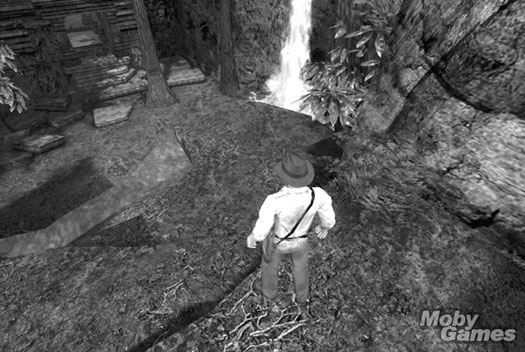
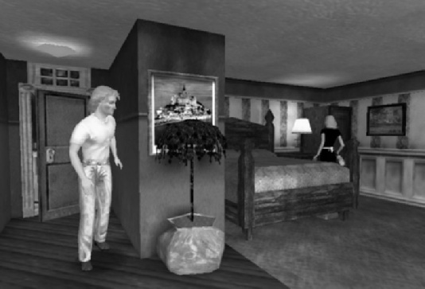
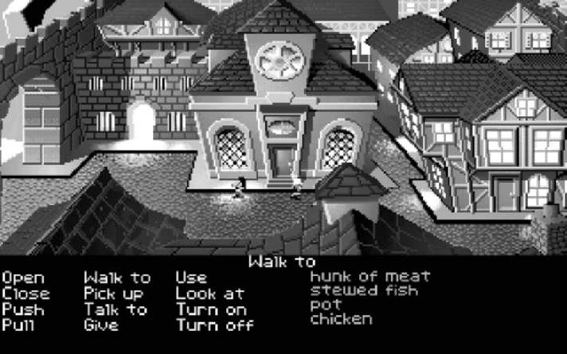
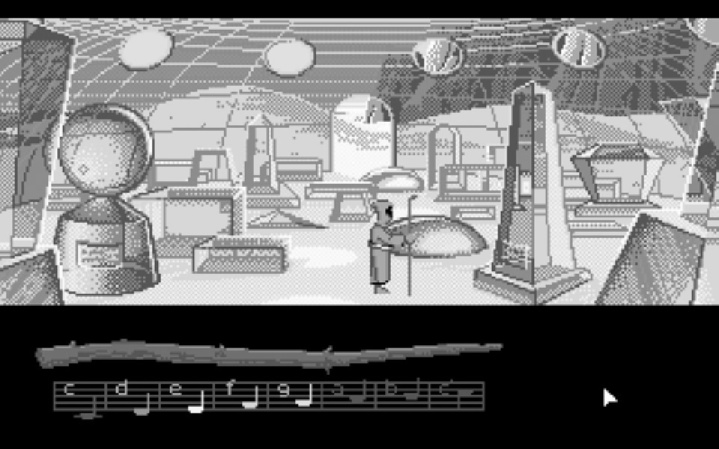

# 第14回：アドベンチャーゲームとパズル・人工生命ゲーム

---

## 1. アドベンチャーゲーム

### 1.1 アドベンチャーゲームとは何か

「アドベンチャーゲーム」という名称は、1970年代に開発されたテキストゲーム *Adventure*（別名 *Colossal Cave*）に由来する。現在のアドベンチャーゲームは、その直系の子孫にあたるが、当時にはなかった多くの機能を備えている。

> **定義：アドベンチャーゲーム**
> プレイヤーが操作する主人公キャラクターについてのインタラクティブな物語である。ストーリーテリングと探索がゲームの本質的要素であり、パズル解きと概念的チャレンジがゲームプレイの大部分を占める。戦闘、経済管理、アクションチャレンジは最小限か存在しない。

ゲーム内の関係性は数値的ではなく象徴的であり、経済システムの最適化はゲーム体験に含まれない。この点がRPGとの重要な違いである。

### 1.2 アドベンチャーゲームの発展

- **テキスト時代**：MITの学生が *Adventure* に触発されて *Zork* を開発し、Infocom社を設立
- **グラフィカル時代**：LucasArtsとSierra On-Lineがジャンルを牽引。*Myst* は長年PC史上最も売れたゲームだった
- **現在**：3Dグラフィックスで臨場感が向上。「死んだジャンル」ではなく、宣伝が少ないだけで健在

### 1.3 アクションアドベンチャー

3Dハードウェアの登場により、アクションとアドベンチャーのハイブリッドである**アクションアドベンチャー**が生まれた（例：*Indiana Jones*、*Zelda* シリーズ）。純粋なアドベンチャーよりテンポが速く、身体的・概念的チャレンジの両方を含む。現在は伝統的アドベンチャーより人気が高い。

**リプレイ性の問題**：パズルに唯一の解がある場合、再プレイの価値が低い。解法に選択肢を与えストーリーに影響させることで改善できる。ただし実際には多くのプレイヤーはゲームを完了しないため、大きな問題にはならない。

### 1.4 ゲームの特徴

#### 舞台設定と感情表現

アドベンチャーゲームでは舞台設定が他のどのジャンルよりもエンターテインメント価値に貢献する。ペースが遅いことで、独特の感情的トーンを持つ世界を創造できる（例：*Phantasmagoria* のホラー、*Myst* のシュールさ、*Shadow of the Colossus* の壮大さ）。

#### インタラクションモデルとカメラ

アドベンチャーゲームは常にアバターベースのインタラクションモデルを使用する。カメラモデルには3つの主要な方式がある：

| カメラモデル | 特徴 | 代表例 |
|---|---|---|
| **コンテキスト感応型** | アバターの現在位置に最適なカメラアングルを自動選択。映画的な演出が可能 | *Leisure Suit Larry*、*A Vampyre Story* |
| **一人称視点** | 世界への没入感が最も高いが、アバターが見えない。アクション寄りのプレイを誘発しやすい | *Myst* |
| **三人称視点** | アバターを常に表示。アクションアドベンチャーで一般的。カメラ操作の自由度が重要 | *Indiana Jones*、*Gabriel Knight 3* |

#### ストーリーと空間構造

アドベンチャーゲームはストーリーを空間にマッピングする。その構造は時代とともに進化してきた：

1. **初期型（探索重視）**：広大な空間を自由に歩き回る。ストーリーの進行感は薄い
2. **章立て型（ストーリー重視）**：ゲームをチャプターに分割し、次章に進むと後戻りできない。フォールドバック・ストーリー構造と同等
3. **アクションアドベンチャー型**：より直線的で、FPSに近い空間構造。探索よりも戦闘チャレンジを重視

#### 探索とインベントリ

プレイヤーは探索可能な領域でパズルを解き、新領域の開放やストーリーの進行を得る。**インベントリ管理**はほとんどの作品で必須であり、ポップアップ式ボックスの固定サイズで携帯量を自然に制限する方法が一般的である。

### 1.5 チャレンジ（パズル）の種類

アドベンチャーゲームのチャレンジの大部分は、水平思考（ラテラルシンキング）で解く概念的パズルである：

- **鍵と扉のパズル**：進行を妨げる障害物（扉）と、それを除去するオブジェクト（鍵）
- **謎の機械の操作**：つまみを操作して正しい表示を出す組み合わせ錠のようなパズル
- **到達困難なオブジェクトの入手**：見えるが手が届かない物を、工夫して入手する
- **人物の操作**：人物の弱点を会話で探り、説得・気をそらすなどして通過する
- **迷路の攻略**：控えめに使い、必ず観察力で発見できる手がかりを含める
- **暗号解読**、**記憶パズル**、**収集パズル**、**探偵的推理**、**社会的問題の理解**

> **設計原則**：パズルには複数の論理的解法を許容すること。プレイヤーが論理的に試みた方法が理由なく機能しない場合、フラストレーションが生じる。

### 1.6 避けるべき設計上の問題

| 問題 | 説明 |
|---|---|
| **試行錯誤でしか解けないパズル** | 手がかりのない組み合わせ錠。プレイヤーは全パターンを総当たりするしかない |
| **概念的な飛躍（ノンセクイター）** | 「ソンブレロをブルドーザーに被せる」式の非論理的解法 |
| **非論理的空間** | 北に進んでBに着くが、南に戻ってもAに戻らない。手がかりなしの試行錯誤になる |
| **外部知識を要求するパズル** | 特定の映画やTV番組の知識がないと解けない |
| **正しいピクセルをクリックするパズル** | 画面上の極小の領域をクリックさせる怠惰な設計 |
| **逆順パズルの多用** | パズルより先に解法（鍵）を見つけてしまい、チャレンジにならない |
| **FedExパズルの多用** | 物をA地点からB地点に運ぶだけの単調な繰り返し |

### 1.7 プレゼンテーション層

アドベンチャーゲームは、プレイヤーがコンピュータを使っていることを隠すよう努める。UIは直感的でシンプルであるべきだ。

- **移動方式**：ポイント＆クリック（間接制御、伝統的標準）とダイレクトコントロール（直接操作、アクションアドベンチャーの標準）
- **オブジェクト識別**：動的ハイライト（カーソル通過で反応）が主流。ハント＆クリックは非推奨
- **操作方式**：ワンボタンアクション（汎用の「使う」ボタン）またはメニュー駆動（「見る」「話す」「触る」のアイコン選択）

> **キーポイントまとめ（アドベンチャーゲーム）**
> - アドベンチャーゲームはインタラクティブな物語であり、探索・パズル・ストーリーテリングが核心
> - アクションアドベンチャーはアクション要素との混合型で、現在より主流
> - 舞台設定が他のどのジャンルよりも重要な役割を果たす
> - パズル設計では、論理的な複数解法の許容と、避けるべきアンチパターンの理解が不可欠
> - UIは没入感を損なわないシンプルさが求められる

---

## 2. 人工生命（A-Life）ゲーム

### 2.1 人工生命ゲームとは

人工生命（A-Life）は、生物学的プロセスをモデル化するコンピュータサイエンスの一分野であり、特に**創発特性**（emergent properties）――複雑なシステムの相互作用から予期せず生じる性質や行動――の研究を行う。商用A-Lifeゲームは、ユニークな生物の集団を管理・育成することに焦点を当てる。

#### コンウェイのライフゲーム

コンウェイの *Life* は2次元グリッド上のセル・オートマトンで、3つの単純なルール（死亡・生存・誕生）から「グライダー」等の創発的パターンが生まれ、A-Life研究の原点となった。

### 2.2 人工ペット

人工ペットはA-Lifeゲームの一カテゴリーで、コンピュータやモバイルデバイス上に住むシミュレートされた動物である。

- **例**：*Nintendogs*（リアルな犬の世話）、*Tamagotchi*（キーチェーン型の簡易電子ペット）
- **設計上の特徴**：
  - ほぼ常にかわいらしく、訓練・世話・観察がゲームプレイの中心
  - 豊富なAI（多様な刺激と行動レパートリー）が必要
  - 感情やムードを持ち、プレイヤーが観察で状態を読み取り、働きかけで影響を与えられる
  - 学習能力が必須（学習が遅すぎても速すぎても問題）
  - 明確な勝利条件がないため、厳密にはゲームよりも**ソフトウェアトイ**に近い

### 2.3 The Sims：最も成功したA-Lifeゲーム

*The Sims* は郊外の家庭をシミュレートする「仮想ドールハウス」で、人工ペットとCMS（建設・管理シミュレーション）の特徴を併せ持つ。

#### ニーズシステム

各シムには6つのニーズ（**空腹、衛生、膀胱、体力、楽しさ、社交**）があり、マズローの欲求階層説に基づく。低次の生理的ニーズが優先され、充足後に高次ニーズへ移行する。

#### スキルと性格

- **スキル**（料理、修理、カリスマ等6種）は就職・収入に影響し、時間管理がゲームの核心
- **性格特性**は親密度計算に使用。「我慢できない」「類は友を呼ぶ」「正反対が惹かれ合う」の3ルールで関係性を決定

#### 成功の理由

1. **創造性**：家の建築からスキン制作、写真付きストーリー作成まで幅広い創作活動
2. **人間関係の重視**：人間関係をテーマにし、幅広い層（特に女性プレイヤー）に支持された

### 2.4 ゴッドゲーム

ゴッドゲームは、プレイヤーが限定的な力を持つ神の役割を担うサブジャンルである。

- 俯瞰視点で民衆を間接制御し、ライバルの神と対決する
- 民衆の数に比例して「マナ」（神の力）が増加し、土地整備や自然災害（洪水、地震等）に消費する
- 人口→マナ→人口の正のフィードバックを、繁殖遅延・コスト増大で制御
- 代表作：*Populous*、*Dungeon Keeper*、*Black & White*

### 2.5 遺伝的A-Lifeゲーム

個体ではなく集団を世代にわたって管理するA-Lifeゲーム。代表作は *Creatures* シリーズ。

- **ゲノム設計**：可変特性をアレル（対立遺伝子）として定義し、優性・劣性の仕組みで多様性を維持
- **突然変異と自然淘汰**：未成熟期→成熟期の段階を設け、不適応個体を繁殖前に淘汰。致死的突然変異は避ける
- **Spore**：人工ペット＋RTS＋ゴッドゲームのハイブリッドであり、遺伝的A-Lifeゲームではない

> **キーポイントまとめ（人工生命ゲーム）**
> - A-Lifeゲームは生物学的プロセスのシミュレーションに基づき、創発特性が核心概念
> - 人工ペットは豊富なAIと学習能力が重要で、勝利条件のないソフトウェアトイ的性質を持つ
> - *The Sims* の成功はマズローの欲求階層に基づくニーズシステムと、人間関係シミュレーションの魅力にある
> - ゴッドゲームはマナ経済と間接制御が特徴
> - 遺伝的A-Lifeゲームではゲノム・突然変異・自然淘汰の設計が鍵

---

## 3. パズルゲーム

### 3.1 パズルゲームの定義

パズルゲームとは、パズル解きが主要な活動であるゲームである。パターン認識、論理的推論、プロセスの理解などが求められる。ただし、ランダムなパズルの寄せ集めではなく、関連するチャレンジの変奏として提示されるべきである。

- *Tetris* のような厳しい時間制約下のパズルは、論理よりも身体的協応が求められるため、アクションパズルに分類される
- 商業的成功のためには、**挑戦的だが難しすぎず**、**視覚的に魅力的**で、**十分なプレイ量**が必要

### 3.2 Scott Kimの8ステップ

パズルデザイナーのスコット・キムが提唱したパズルゲーム設計の8段階：

| ステップ | 内容 |
|---|---|
| **1. インスピレーション** | 他のゲーム、芸術（M.C.エッシャーなど）、物語、操作のダイナミクス（切り替え、スライド、接続など）からアイデアを得る |
| **2. 単純化** | 本質的な「厄介な核心スキル」に集中し、無関係な要素を排除。ピースを標準化し、操作を最小限に |
| **3. 構築セット作成** | プロトタイプを作成してルールを検証。プレイヤーが自作パズルを作れる機能も検討 |
| **4. ルール定義** | ボード（グリッド？ネットワーク？）、ピース（形・属性）、手（許可・禁止・副作用）、勝利条件を決定 |
| **5. パズル構築** | 問題から解へのパスに分岐と行き止まりを配置。プレイヤーに「わかった！」という洞察の瞬間を与える |
| **6. テスト** | 難易度、楽しさ、代替解法、ルールの誤り、UIの使いやすさを検証 |
| **7. 配列設計** | 易→難の単調増加ではなく、**のこぎり歯型**（難しくなった後に易しい問題を挟む）が効果的。メタパズルでモチベーションを維持 |
| **8. プレゼンテーション** | サウンド、グラフィック、アニメーション、UI。パズルが90%の戦いなので、まずパズルを完成させてから取り組む |

### 3.3 コンピュータがパズルにもたらすもの

コンピュータは物理的に不可能なパズルを実現し、以下の利点をもたらす：

- **非物理的操作**（色の変更、同時制御）、**ルールの自動強制**、**アンドゥ機能**
- **計算機能**（自動生成、ヒント提供）、**チュートリアル**、**体験の構造化**
- **演出効果**（サウンド・アニメーション）、**オンラインプレイ**（対戦・コミュニティ）

### 3.4 勝利条件の確認における注意

プレイヤーが**勝利条件を満たしたかどうか**だけを確認し、**想定した方法で解いたか**は問わないことが重要である。*Interstate '76* では、設計者が隠しスロープを想定したが、プレイヤーは地雷爆発で壁を越える方法を発見した。しかし判定がスロープ使用を確認していたため正当な脱出が認められなかった。このような設計は避けるべきである。

> **キーポイントまとめ（パズルゲーム）**
> - パズルゲームはパズル解きが主活動で、関連性のあるチャレンジの変奏として設計する
> - Scott Kimの8ステップは、インスピレーションから単純化、プロトタイプ、テスト、配列までの体系的設計手法
> - のこぎり歯型の難易度曲線が、単調増加より効果的
> - コンピュータはルール強制・アンドゥ・自動生成など、物理パズルにない利点をもたらす
> - 勝利条件の判定は「結果」を見るべきで、「方法」を限定すべきではない

---

## 本講のまとめ

**アドベンチャーゲーム**はインタラクティブな物語・探索・パズルが核心で、舞台設定と没入感を重視したUIが鍵。**人工生命ゲーム**は創発特性を活用し、*The Sims* のニーズシステムと人間関係シミュレーションが成功例。**パズルゲーム**はScott Kimの8ステップによる体系的設計と、公平な勝利条件判定が重要である。

---

*参考：Fundamentals of Game Design, Chapter 19 "Adventure Games" & Chapter 20 "Artificial Life and Puzzle Games"*
